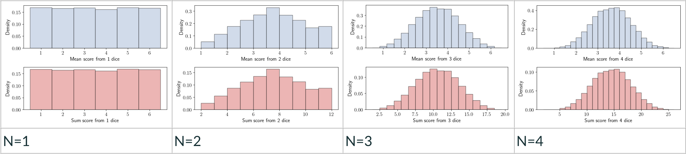
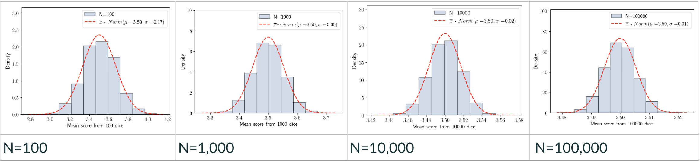

---
jupytext:
  formats: md:myst
  text_representation:
    extension: .md
    format_name: myst
kernelspec:
  name: python3
  display_name: 'Python 3'
---

# The Normal Distribution

Many RVs are "Normally Distributed", meaning they follow a Gaussian Probability Distribution. Some examples are shown in are shown in [](#fig:norm-everywhere).

:::{figure} 
:label: fig:norm-everywhere
:align: left


A selection of normal distributions (sources unclear at time of writing, TBD).
:::

The RVS plotted are blood pressures, baby birth weights, heights of English criminals in 1900, and the difference between the proton speeds measured with two different detectors. These are very different RVs, but when we plot their measured values, they all follow this same shape, with a symmetric distribution around a central value. Why?!

The reason for the apparently unrelated RVs in [](#fig:norm-everywhere) having the same underlying distribution is that **they do have something fundamental in common**: they are all the result of many interrelated factors, which makes them "sums" of different independent variables. We will see that the distribution of a sum will always tend towards a Gaussian distribution (the Central Limit Theorem).


## The Gaussian PDF

The Gaussian (aka Normal) Probability Distribution Function (PDF) is given in [](#eq:gaus_pdf). It describes Continuous RVs (eg blood pressure, height, weight, proton speed differences).

$$\label{eq:gaus_pdf} f_X (x; \mu,\sigma) = \dfrac{1}{\sqrt{ 2\pi\sigma^2} } \exp{\left[-\frac{1}{2} \frac{(x-\mu)^2}{\sigma^2}}\right]$$

A plot of the Gaussian for a choice of parameters is shown in [](#fig:gaussian).

:::{figure} 
:label: fig:gaussian
:align: left


A Gaussian PDF with the mean $\mu$ indicated by the red dashed vertical line.
:::

It may be helpful to consider each term in [](#eq:gaus_pdf) while looking at the plot.


 $f_X (x; \mu,\sigma)$
 : The notation for a PDF describing a continuous RV, X.
  The value of $f_X$ for a given $x$ depends on (is conditional on) the values of the parameters $\mu$ and $\sigma$.

$\dfrac{ 1 }{ \sqrt{ 2\pi\sigma^2} }$
: The "constant" term is a function of the true standard deviation $\sigma$.
  We say this term is constant because it does not vary with x.
  This term tells us the max height of the distribution, because the max of $\exp[-y]$ is 1 (when $y=0$).

$\exp$
: The exponential function. $\exp{[y]} \equiv e^y$.
  Euler's number $e\approx 2.718$

$\dfrac{(x-\mu)^2}{\sigma^2}$
: The argument of the exponential is a function of both parameters and the RV.
  The numerator $(x-\mu)^2$ is the squared deviation between the RV and the true mean.
  The denominator $\sigma^2$ is the true variance.

## Parameters


The Gaussian has two parameters, $\mu$ and $\sigma$. The effects of the values of these on the PDF are illustrated in [](#fig:gaussian_params).

The **location parameter**, $\mu$, is the True Mean of the distribution, also known as the expectation [](#eq:expectMu) for the normally distributed RV X. Changing this parameter moves the central value of the distribution left or right along the x-axis.

The **scale parameter**, $\sigma$, is the True Standard Deviation of the distribution. Changing this parameter stretches or squishes the distribution.


:::{figure} 
:label: fig:gaussian_params
:align: left


An illustration of the PDF stretching when we increase the scale parameter $\sigma$, and shifting when we change the location parameter $\mu$.
:::

## The Standard Normal PDF and Z value

If we choose the mean of the distribution to be zero and set the standard deviation to be 1, 

$$\mu=0,\; \sigma=1$$,

we can write down the **Standard Normal PDF**:

$$\label{eq:standard-norm} f_X(x) = \dfrac{1}{ \sqrt{2\pi}} \exp{\left[-\dfrac{x^2}{2}\right]}$$

The Standard Normal PDF is a single instance of an infinite family of possible Gaussians. 

Instead of fixing the parameters to the specific values $\mu=0,\; \sigma=1$, we can gobble them up into a new RV, $z$:

 $$\label{eq:z} z=\dfrac{x-\mu}{\sigma}$$

Now we can write:

$$\label{eq:standard-norm-z} f_X(x) = \dfrac{1}{ \sqrt{2\pi\sigma^2}} \exp{\left[-\dfrac{z^2}{2}\right]}$$

Notice that this form looks is identical to the [Standard Normal PDF](#eq:standard-norm), but for a factor of $\dfrac{1}{\sigma}$.

The new variable [](#eq:z) is known as the Standard Normal variable, the pull, the Z score, the Z statistic, the Z value. Many different names for the same guy. I will call it the **Z value** because it is very closely related to the **p value**, as we shall see shortly.

Notice that rearranging [](#eq:z) gives:

$$\label{eq:zsigma} x = z\,\sigma + \mu$$

From [](#eq:zsigma), we can see that the Z value, $z$, **tells us how many $\sigma$ away from the mean $\mu$ our measurement $x$ is**.


:::{figure} 
:label: fig:nsigma
:align: left


A Gaussian PDF with shaded areas corresponding to $\mu\pm 1\sigma$, $\mu\pm 2\sigma$, and $\mu\pm 3\sigma$.
:::


The Z value tells us how likely our measurement is, because the nature of a Gaussian distribution is such that a given fraction of its area is within a given number of standard deviations from the mean.

You may have heard of the [68-95-99.7 Rule](https://en.wikipedia.org/wiki/68%E2%80%9395%E2%80%9399.7_rule), which is designed to help people remember what fraction of a Gaussian PDF is within 1-2-3 standard deviations from the mean. We can see this correspondence for ourselves in [](#fig:nsigma), which also notes the **p values**. Notice that subtracting each percentage in the rule from 100% gives us the p values for 1-2-3 $\sigma$.

The neat statistical properties of a Gaussian hold for any choice of the parameters $\mu$, $\sigma$. 


## Probability and The Infinite Range 

Looking at [](#fig:nsigma), you could be forgiven for thinking that 100% of the distribution is covered by a Z value of perhaps 4 or 5 $\sigma$, but in fact **the Gaussian distribution has an infinite range**, never reaching zero in probability.


Let's plot the Gaussian PDF using the ```norm``` method from the ```scipy.stats``` library:

```{code-cell} python
import numpy as np 
import matplotlib.pyplot as plt
from scipy.stats import norm

def my_norm(mu,sigma):
	
	# define our PDF using scipy's norm distribution and our chosen parameters
	# the parameters mu and sigma are arguments to this function definition

	norm1 = norm(loc=mu, scale=sigma)

	# the norm PDF is a f(x; mu, sigma): we must also provide values of our RV x

	# this gives us an array of 100 x values in the defined range:
	# min: mu - 5*sigma
	# max: mu + 5*sigma

	xvals = np.linspace( mu-5*sigma, mu+5*sigma, 100 )

	# we could have set the x values without reference to the params, eg
	# xvals = np.linspace(-5,5,100)
	# but unless we choose mu=0, this will give us a wonky view of the pdf

	# the PDF, which we already set the parameters for, is just a function of x:
	pdf = norm.pdf(xvals) 

	# could also do this in one line if preferred:
	# pdf = norm.pdf(xvals, loc=mu, scale=sigma) 

	plt.plot( xvals, pdf )  
	plt.show()


# call the function for eg mu=1, sigma=2

my_norm(1,2)

```

To go some way towards convincing ourselves that the Gaussian PDF is infinite in range, let's change the scale of the y-axis to be **Logarithmic** using the ```semilogy``` method from ```matplotlib```:

```{code-cell} python
def my_norm_log(mu,sigma):

    norm1 = norm(loc=mu, scale=sigma)

    xvals = np.linspace(mu-5*sigma,mu+5*sigma,100)

    pdf = norm1.pdf(xvals)    

    plt.semilogy( xvals, pdf, base=np.e )  #<= natural logarithm, base e
    plt.show()

my_norm_log(1,2)
```

On the log scale plot, we can see that the Gaussian PDF has non-zero probabilities all the way to $\pm 10 \sigma$. We can also see the the **log of the Gaussian PDF is a parabola** ($y \sim - x^2$).

We can write down the most basic form (**Kernel**) of the Gaussian as [](#eq:gaus_kernel); at its heart, the Gaussian is just an exponential distribution of the square of our RV.

$$\label{eq:gaus_kernel} f_X(x) \propto  \exp{\left[-x^2/2\right]} $$

Taking the natural logarithm of this gives us [](#eq:gaus_kernel_log).

$$\label{eq:gaus_kernel_log} \ln{f_X(x)} \propto -x^2/2 $$


:::{dropdown} Calculation of log Norm

```{math}
\begin{align*}
\ln{f_X(x;\mu,\sigma)} &= \ln{ \left[ \frac{1}{\sigma \sqrt{2\pi}} e^{-\frac{1}{2} \frac{(x-\mu)^2}{\sigma^2} } \right] }&\\

&= \ln{\left[ \dfrac{1}{\sigma \sqrt{2\pi}} \right]} + \ln{\left[ e^{-\frac{1}{2} \frac{(x-\mu)^2}{\sigma^2} } \right]}&\blu{\;because\; \ln{ab} = \ln{a} + \ln{b}} \\

&= \ln{\left[ \dfrac{1}{\sigma \sqrt{2\pi}} \right]} -\frac{1}{2} \frac{(x-\mu)^2}{\sigma^2}  &\blu{\;because\; \ln{e^a} = a} \\

&= -\ln{ \sigma \sqrt{2\pi}} -\frac{1}{2} \frac{(x-\mu)^2}{\sigma^2} &\blu{\;because\; \ln{\frac{1}{a}} = -\ln{a} }\\
&= -\ln{ \sigma} -\ln{ \sqrt{2\pi} } - \frac{1}{2} \frac{(x-\mu)^2}{\sigma^2} &\blu{\;because\; -\ln{ab} = -\ln{a} - \ln{b}}  \\		
\end{align*}
```
:::


Beautifully, [we can show](https://www.youtube.com/watch?v=fWOGfzC3IeY) that:

 $$\int\limits_{-\infty}^{\infty} e^{-x^2} dx = \sqrt{\pi}$$

However, we cannot write down an analytical solution to the integral of our kernel:

$$\int\limits_{-\infty}^{\infty} e^{-x^2/2} dx$$

The integral of the Gaussian PDF has **no analytical solution**. We can always calculate a numerical solution though, so its okay!


## The Central Limit Theorem (CLT)

The CLT answers the question: Why are so many things Gaussian-distributed? 

The distribution of a sum (or mean) of independent RVs will always converge to a normal distribution, in the limit of an infinite number of measurements.

My height is dependent on many factors. My parents' heights are the most obvious ones. Their parents' heights, my great-grandparents' diets, the environment, and all sorts of genes that may be turned on or off.

My height is the result of the sum of all of these effects. That is why the distribution of heights is Gaussian.

[Here](#fig:clt1) is a series of histograms showing the mean and sum of the total scores from rolling 1,2,3,4 dice. We can see the distribution already starts to take a Gaussian shape with N=4. [Here](#fig:clt2) is the mean distribution for larger values of N, with a True Gaussian distribution drawn on the same axes (the red dashed line).

:::{figure} 
:label: fig:clt1
:align: left


:::

:::{figure} 
:label: fig:clt2
:align: left


:::


## Probablities for a Continuous RV

A PDF $f_X(x|\theta)$ is a **Probability Density Function**. It has integral 1, and describes the distribution of probabilities for a **Continuous** Random Variable. I have used the symbol $\theta$ to represent the parameters of the PDF.  In the case of a normal distribution, the parameters are $\theta = \mu, \sigma$ as we know.

Because X is **Continuous**, there is no limit to the precision its values ($x_i$) can take. There are an infinite number of possible values. This means there is an infinitesimally small (zero) probability for any exact value $x_i$.

We cannot calculate the probability for any exact value of the RV X, but we can calculate the probability that X lies in some range of values. We do this using the Cumulative Distribution Function (CDF).

## The Cumulative Distribution Function (CDF)


The CDF returns the probability of measuring the RV with some value equal to or less than a given value. For a Continuous RV $X$, the CDF is written in [](#eq:cdf_cont). For a Discrete RV $K$, the integral is replaced with a sum, [](#eq:cdf_disc). 

```{math}
:label: eq:cdf_cont

F(x) = P(X\leq x) = \displaystyle \int \limits_{-\infty}^{x} f_X(x|\theta)\, dx

```

```{math}
:label: eq:cdf_disc

F(k) = P(K\leq k) = \displaystyle \sum_{K\leq k} p(k|\theta)\, dk

```

We have already noted that there is no **analytical** solution to the integral of the Gaussian PDF. But we only need to solve the integral **numerically** to calculate probabilities this way. 

The ```scipy.stats.norm``` function is the easiest way to do this; we used to use look-up tables, so many text books will advise you to do this. Life is easier now.


```{code-cell} python

def my_norm_cdf(mu,sigma):

    norm1 = norm(loc=mu, scale=sigma)

    xvals = np.linspace(mu-5*sigma,mu+5*sigma,100)
 
    cdf = norm1.cdf(xvals)    

    plt.plot( xvals, cdf, c='red')

    plt.show()

my_norm_cdf(1,2)

```

Note that the PDF and CDF are arrays of y-values corresponding to the array of x-values we have passed in as the argument.

**The PDF values are not probabilities**. They only have meaning relative to one another, giving us the shape of the distribution in case we want to plot it, for example.

The CDF values are probabilities. They are cumulative. So if $x=0.1$, ```norm.cdf(x)``` is the probability of any value up to and including 0.1.

To find the probability of eg $0.15 < x <0.16$, we can subtract the probability from the lower end from that of the upper end:

```{code-cell} python
mu,sigma = 0,1

prob_upto_015 = norm.cdf(mu, sigma, 0.15)
prob_upto_016 = norm.cdf(mu, sigma, 0.16)

prob_015_to_016 = prob_upto_016 - prob_upto_015
```


## Multivariate Gaussian

A Gaussian distribution of more than one RV makes for some nice visual tools, and felt like a good opportunity to use the ```seaborn``` and ```pandas``` packages.

The Multivariate Gaussian PDF is very similar to the [univariate version](eq:gaus_pdf), the main difference being that we have the [Covariance Matrix](#eq:covmat-dep) $\Sigma$ in place of the variance $\sigma^2$.

```{math}
:label: eq:gaus_multi

f_X(x;\mu,\Sigma) =\dfrac{ 1}{ |\Sigma|^{1/2}  (2\pi)^{Z/2} } \exp\left[-\frac{1}{2} (x-\mu)^\mathsf{T} \Sigma^{-1} (x-\mu) \right]

```

```{code-cell} python
import numpy as np
from scipy.stats import multivariate_normal
import seaborn as sns
import pandas as pd
import matplotlib.pyplot as plt

def MultiVariateGaus(mu,covmat):

	XYdist = multivariate_normal(mu, covmat)

	# pull 1000 random varables from the theoretical universe
	rvs= XYdist.rvs(size=1_000) 

	# make a pandas DataFrame to hold our RV values
	df = pd.DataFrame(rvs, columns=["x", "y"])

	# use seaborn to make a nice plot

	g = sns.JointGrid(x=df["x"], y=df["y"])

	# 2D plot
	g.plot_joint(sns.kdeplot,fill=True,label=f"{covmat}")

	# include the 1D distributions above and to the right of the 2D plot
	g.plot_marginals(sns.histplot,fill=True)

	# set the limits on the x-axis and y-axis
	g.ax_marg_x.set_xlim(-10,10)
	g.ax_marg_y.set_ylim(-10,10)

	# set the axis labels
	g.ax_joint.set_xlabel(r'x',fontsize=16)
	g.ax_joint.set_ylabel(r'y',fontsize=16)

	# print the label (covariance matrix) on the plot
	plt.legend()

	plt.show()

	return df

# call the function, passing the true means and the covariance matrix as arguments

# mu_x, mu_y passed as a list: set both to zero
mu = [0, 0]

# example of no covariance term, equal sigmas (sqrt(5))
cov = [[5,0],[0,5]] 

# calling the function makes the plot and returns the dataframe
df = MultiVariateGaus(mu,cov)

# try a broader x-distribution
cov2 = [[10,0],[0,5]] 
df2 = MultiVariateGaus(mu,cov2)

# add covariance in the off-diagonal
cov3 = [[10,5],[5,5]] 
df3 = MultiVariateGaus(mu,cov3)

# print the first five (x,y) vals from the DataFrame
print(f"{df3.iloc[:5, :5]} ")

# print the sample mean for x 
print(f"mean x: {df3.x.mean()} ")

# print the sample standard deviation for y 
print(f"std y: {df3.y.std()} ")

# print the maximum value of y 
print(f"std y: {df3.y.max()} ")

```

## Learning Objectives Checklist

- [ ] Explain why the normal distribution is so prevalent
- [ ] Explain why the CDF, rather than PDF, must be used for calculating probabilities for continous RVs
- [ ] Plot the Normal PDF and CDF 
- [ ] State the formula for calculating the Z value, and calculate Z values
- [ ] Describe the terms present in the Gaussian PDF
- [ ] Describe the location and scale parameters, and demonstrate the effect of changing them
- [ ] State the Central Limit Theorem

