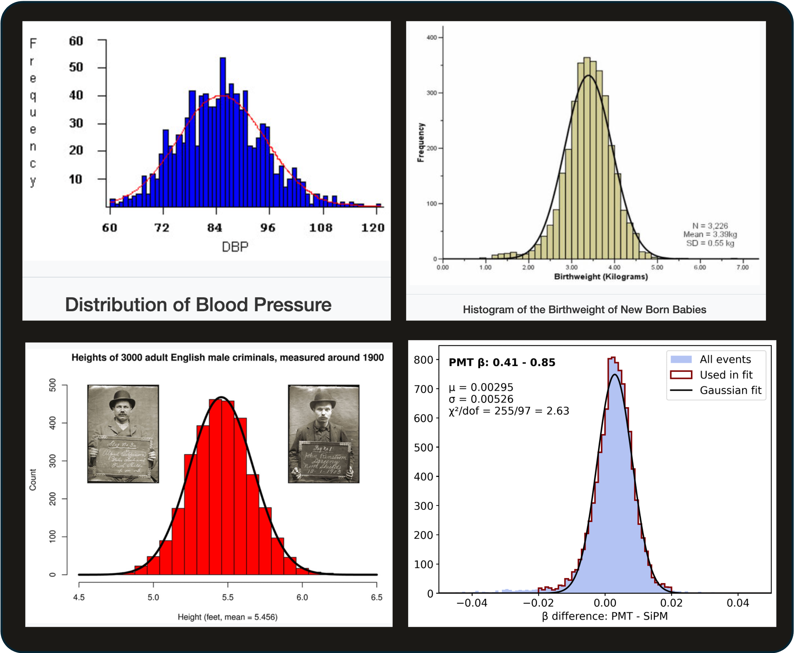
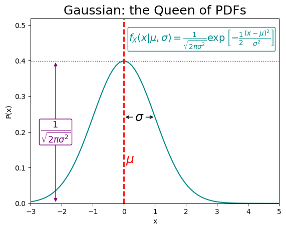
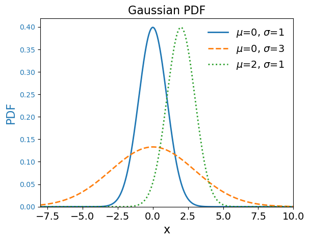
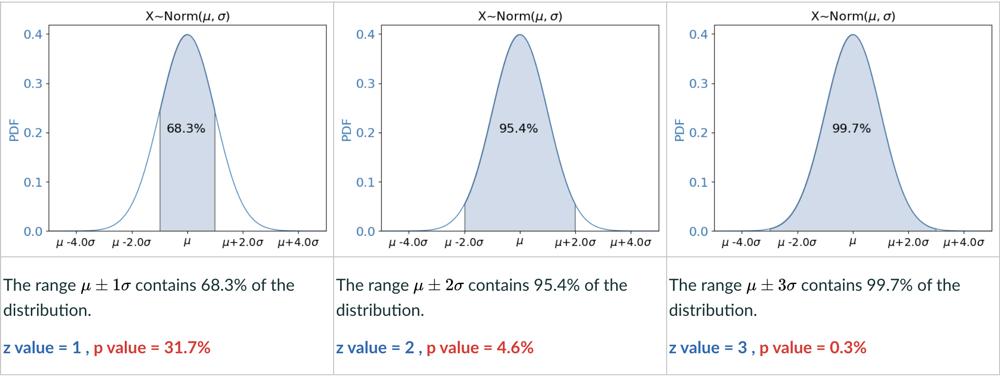

---
jupytext:
  formats: md:myst
  text_representation:
    extension: .md
    format_name: myst
kernelspec:
  name: python3
  display_name: 'Python 3'
---

# The Normal Distribution

Many RVs are "Normally Distributed", meaning they follow a Gaussian Probability Distribution. Some examples are shown in are shown in [](#fig:norm-everywhere).

:::{figure} 
:label: fig:norm-everywhere
:align: left


A selection of normal distributions (sources unclear at time of writing, TBD).
:::

The RVS plotted are blood pressures, baby birth weights, heights of English criminals in 1900, and the difference between the proton speeds measured with two different detectors. These are very different RVs, but when we plot their measured values, they all follow this same shape, with a symmetric distribution around a central value. Why?!

The reason for the apparently unrelated RVs in [](#fig:norm-everywhere) having the same underlying distribution is that **they do have something fundamental in common**: they are all the result of many interrelated factors, which makes them "sums" of different independent variables. We will see that the distribution of a sum will always tend towards a Gaussian distribution (the Central Limit Theorem).


## The Gaussian PDF

The Gaussian (aka Normal) Probability Distribution Function (PDF) is given in [](#eq:gaus_pdf). It describes Continuous RVs (eg blood pressure, height, weight, proton speed differences).

$$\label{eq:gaus_pdf} f_X (x; \mu,\sigma) = \dfrac{1}{\sqrt{ 2\pi\sigma^2} } \exp{-\frac{1}{2} \frac{(x-\mu)^2}{\sigma^2}}$$

A plot of the Gaussian for a choice of parameters is shown in [](#fig:gaussian).

:::{figure} 
:label: fig:gaussian
:align: left

:::

It may be helpful to consider each term in [](#eq:gaus_pdf) while looking at the plot.


 $f_X (x; \mu,\sigma)$
 : The notation for a PDF describing a continuous RV, X.
  The parameters $\mu$ and $\sigma$ are the conditionals.

$\dfrac{ 1 }{ \sqrt{ 2\pi\sigma^2} }$
: The "constant" piece is a function of the true variance $\sigma^2$.
  We say this piece is constant because it does not vary with x.
  This term tells us the max height of the distribution, because the max of $\exp[-y]$ is 1 (when $y=0$).

$\exp$
: The exponential function. $\exp{x} \equiv e^x$.
  Euler's number $e\approx 2.718$

$\frac{(x-\mu)^2}{\sigma^2}$
: The argument of the exponential is a function of both parameters and the RV.
  The numerator $(x-\mu)^2$ is the squared deviation between the RV and the true mean.
  The denominator $\sigma^2$ is the true variance.

## Parameters


The Gaussian has two parameters, $\mu$ and $\sigma$. The effects of the values of these on the PDF are illustrated in [](#fig:gaussian_params).

The **location parameter**, $\mu$, is the True Mean of the distribution, also known as the expectation [](#eq:expectMu) for the normally distributed RV X. Changing this parameter moves the distribution left or right along the x-axis.

The **scale parameter**, $\sigma$, is the True Standard Deviation of the distribution. Changing this parameter stretches or squishes the distribution.


:::{figure} 
:label: fig:gaussian_params
:align: left

:::

## The Standard Normal PDF and Z value

If we choose the mean of the distribution to be zero and set the standard deviation to be 1, 

$$\mu=0,\; \sigma=1$$

we can write down the **Standard Normal PDF**:

$$\label{eq:standard-norm} f_X(x) = \dfrac{1}{ \sqrt{2\pi}} \exp{\left[-\dfrac{x^2}{2}\right]}$$

This Non-Parametric form is a little simpler to look like, but is just a single instantiation of an infinite family of possible Gaussians. 

Instead of fixing the parameters to the specific values $\mu=0,\; \sigma=1$, we can gobble them up into a new variable, the **Z value**:

 $$\label{eq:z} z=\dfrac{x-\mu}{\sigma}$$

Now we can write:

$$\label{eq:standard-norm-z} f_X(x) = \dfrac{1}{ \sqrt{2\pi}} \exp{\left[-\dfrac{z^2}{2}\right]}$$

Notice that this form looks is identical to the [Standard Normal PDF](#eq:standard-norm), but for a factor of $\dfrac{1}{\sigma}$.

The new variable [](#eq:z) is known as the Standard Normal variable, the pull, the Z score, the Z statistic, the Z value. Many different names for the same guy. I will call it the **Z value** because it is a friend of the **p value**, as we shall see shortly.

Notice that rearranging this definition for the Z value gives:

$$\label{eq:zsigma} x = z\,\sigma + \mu$$

From [](#eq:zsigma), we can see that **the Z value $z$ tells us how many $\sigma$ away from the mean $\mu$ our measurement $x$ is**.


:::{figure} 
:label: fig:nsigma
:align: left


A Gaussian PDF with shaded areas corresponding to $\mu\pm 1\sigma$, $\mu\pm 2\sigma$, and $\mu\pm 3\sigma$.
:::


The Z value tells us how likely our measurement is because **the nature of a Gaussian distribution is such that a given fraction of its area is within a given number of standard deviations from the mean**.

## The 

You may have heard of the [68-95-99.7 Rule](https://en.wikipedia.org/wiki/68%E2%80%9395%E2%80%9399.7_rule), which is designed to help people remember what fraction of a Gaussian is within 1-2-3 standard deviations from the mean. We can see this correspondence for ourselves in [](#fig:nsigma), which also notes the **p values**. Notice that subtracting each percentage in the rule from 100% gives us the p values for 1-2-3 $\sigma$.

The neat statistical properties of a Gaussian hold for any choice of the parameters $\mu$, $\sigma$. 


## Probability and The Infinite Range 

You would be forgiven, looking at [](#fig:nsigma), for thinking that 100% of the distribution is covered by a Z value of perhaps 4 or 5 $\sigma$, but in fact the Gaussian distribution has an infinite range in both directions, never reaching zero in probability.


Let's plot the Gaussian PDF using the ```norm``` method from the ```scipy.stats``` library:

```{code-cell} python
import numpy as np 
import matplotlib.pyplot as plt
from scipy.stats import norm

def my_norm(mu,sigma):
	
	# define our PDF using scipy's norm distribution and our chosen parameters
	# the parameters mu and sigma are arguments to this function definition

	norm1 = norm(loc=mu, scale=sigma)

	# the norm PDF is a f(x; mu, sigma): we must also provide values of our RV x

	# this gives us an array of 100 x values in the defined range:
	# min: mu - 5*sigma
	# max: mu + 5*sigma

	xvals = np.linspace( mu-5*sigma, mu+5*sigma, 100 )

	# we could have set the x values without reference to the params, eg
	# xvals = np.linspace(-5,5,100)
	# but unless we choose mu=0, this will give us a wonky view of the pdf

	# the PDF, which we already set the parameters for, is just a function of x:
	pdf = norm.pdf(xvals) 

	# could also do 
	# pdf = norm.pdf(xvals, loc=mu, scale=sigma) if preferred

	plt.plot( xvals, pdf )  
	plt.show()


# call the function for eg mu=1, sigma=2

my_norm(1,2)

```

To go some way towards convincing ourselves that the Gaussian PDF is infinite in range, let's change the scale of the y-axis to be **Logarithmic** using the ```semilogy``` method from ```matplotlib```:

```{code-cell} python
def my_norm_log(mu,sigma):

    norm1 = norm(loc=mu, scale=sigma)

    xvals = np.linspace(mu-5*sigma,mu+5*sigma,100)

    pdf = norm1.pdf(xvals)    

    plt.semilogy( xvals, pdf, base=np.e )  #<= natural logarithm, base e
    plt.show()

my_norm_log(1,2)
```

On the log scale plot, we can see that the Gaussian PDF has non-zero probabilities all the way to $+/- 10 \sigma$. We can also see the the **log of the Gaussian PDF is a parabola** ($y~ - x^2$).

We can write down the most basic form (**Kernel**) of the Gaussian as [](#eq:gaus_kernel); at its heart, the Gaussian is just an exponential distribution of the square of our RV.

$$\label{eq:gaus_kernel} f_X(x) \propto  \exp{\left[-x^2/2\right]} $$

Taking the natural logarithm of this gives us [](#eq:gaus_kernel_log).

$$\label{eq:gaus_kernel_log} \ln{f_X(x)} \propto -x^2/2 $$


Beautifully, [we can show](https://www.youtube.com/watch?v=fWOGfzC3IeY) that:

 $$\int\limits_{-\infty}^{\infty} e^{-x^2} dx = \sqrt{\pi}$$

However, we cannot write down an analytical solution to the integral of our kernel:

$$\int\limits_{-\infty}^{\infty} e^{-x^2/2} dx$$

:::{tip}
The integral of the Gaussian PDF  has no analytical solution.
We can always calculate a numerical solution though, so its okay!
:::


## Bivariate Gaussian


## The Central Limit Theorem (CLT)


## The Cumulative Distribution Function (CDF)


## Critical Regions Revisited


- [] Explain why the CDF, rather than PDF, must be used for calculating probabilities for continous RVs
- [] Plot the Normal PDF and CDF 
- [] State the formula for calculating the Z value, and calculate Z values
- [] Describe the terms present in the Gaussian PDF
- [] Describe the location and scale parameters, and demonstrate the effect of changing them
- [] State the Central Limit Theorem