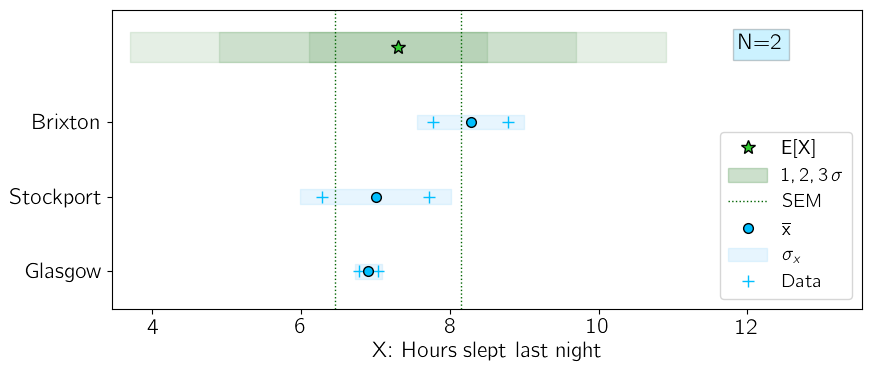
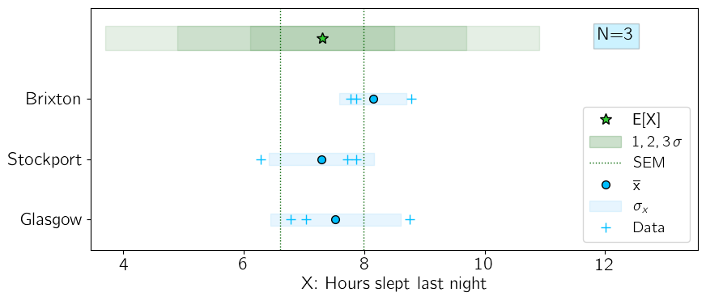
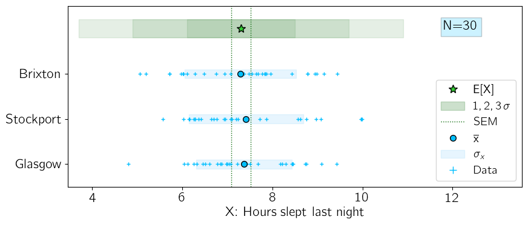
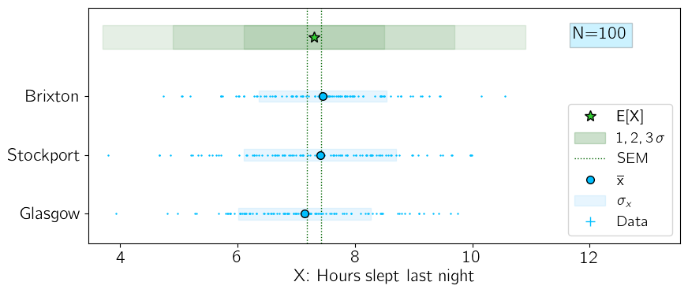
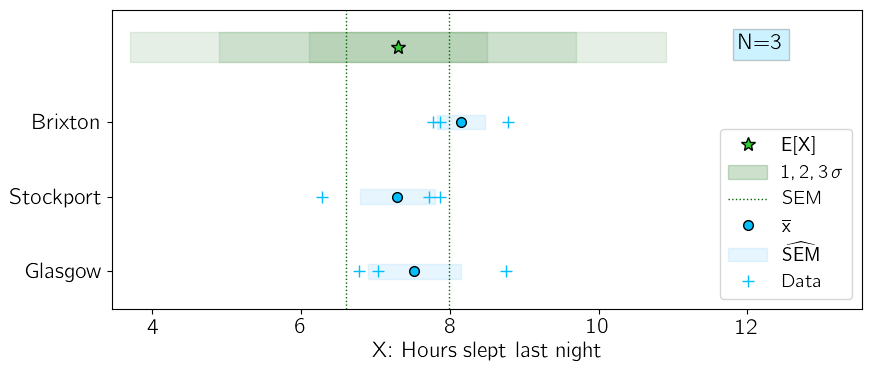
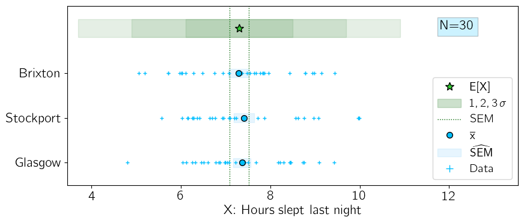
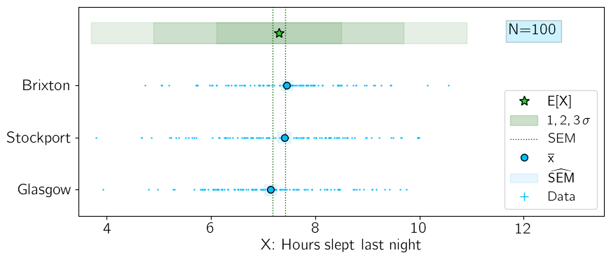

# Normal Tests

## The Standard Error on the Mean

Real world measurements do not have infinite datasets. One consequence of this is that the variance in our small datasets will not accurately reflect the true variance of the underlying PDF.

A set of 50 measurements of X will have some mean, $\overline{x}$, which is a summary statistic of the measurements.

A different set of 50 measurements of X will have some other mean, because real world measurements are samples from a distribution (PDF or PMF) of an infinite number of measurements, languishing in the theoretical universe.

We know from the [CLT]{#CLT} that if we measure the mean from many independent samples, then plot the measured means, we will get a Gaussian distribution (given large enough sample sizes, although the  $N\rightarrow \infty$ criterion in the CLT is clearly impossible to achieve in real life!).

Note: I am using $N$ to denote the size of each sample, which is what the CLT cares about. I am using $n$  for the number of samples, which is the number of means we will have to plot.

Example:

I have $n=80$ employees, and send each of them to a different town in the UK and ask each of them to record the number of text messages sent in the last day by $N=50$ adult women, randomly selected on the streets.

At the end of this endeavour, each employee will have an [IID](#(IID) sample with some mean and variance, such that my combined sample will be formed of $n=80$ means.

**IID Reminder**:  They are **Independent**, because the mean measured in Stockport will have no effect on the mean measured in Brixton.  They are **Identically Distributed** because we are asking the same question everywhere: how many texts have you sent in the last 24H.

The distribution of these mean values will resemble a Gaussian, even though the sample sizes were $N=50$, which is nowhere near the $N\rightarrow \infty$ suggested by the CLT :smile:.


**Question**:  How confident are we in this resulting Gaussian-like distribution of means?


If I did this exact same experiment again on a different day in 80 other towns, I would not get exactly the same distribution of means. Would the mean of my resulting distribution be fairly stable, or would it be likely to fluctuate significantly? If the variable is IID, then this depends only on the number of people asked (in each town) $N$.

We quantify the uncertainty on the mean of the Gaussian using the **Standard Error on the Mean (SEM)**.


The mean of our measurements (yes, it is a mean of means), $\overline{x}$, will not be the same as the True Mean , E[X], but they will be similar, and if we took all possible measurements they would be the same.

Mathematically, we can show that the Expected Value of (each of) the sample means E[$\overline{x}$] is equal to the True Mean E[X].

```{math}

\begin{align*}

\mathsf{E\left[\,\overline{x}\,\right] }&
\mathsf{= E\left[\dfrac{1}{N}\sum\limits_i^N x_i\right] }
 &\;\; \mathsf{\textcolor{blue}{because} \;\;} 
& \mathsf{\overline{x}  = \frac{1}{N} \sum \limits_i^N x_i}\;\;\\

& = \mathsf{\dfrac{1}{N} \sum\limits_i^N E\left[ x_i \right] }
 &\;\; \mathsf{\textcolor{blue}{because} \;\;} 
& \mathsf{E[sum] = sum(E)}
\\
  & = \mathsf{\dfrac{1}{N} \sum\limits_i^N E[X] }
& \;\; \mathsf{\textcolor{blue}{because\;x_i\;are\; iid,\; so\;} \;\;} 
& \mathsf{E[x_i] = E[X]\; \forall\; x_i}
\\
  & = \mathsf{\dfrac{1}{N} N E[X]= E[X]}
\end{align*}

```

The Standard Deviation of our measurements (the SEM) will also not be the same as the True Standard Deviation , and we don't expect it to ever be, even if each employee asks a million people, because they are different things. The SEM is the measured variation of the means, which will depend on $N$ (how many people each of my employees ask for their data), whereas the True Standard Deviation is a fixed value, a parameter of the underlying distribution.


The Variance on the measured means is $\mathsf{V[\,\overline{x}\,] = \sigma^2_{\overline{x}} = \mathsf{SEM}^2}$.

The True Variance is $\mathsf{V[X] = \sigma^2_{true} }$.


```{math}
\begin{align*}
\mathsf{V\left[\,\overline{x}\,\right] }&
\mathsf{= V\left[\dfrac{1}{N}\sum\limits_i^Nx_i\right] }
 &\;\; \mathsf{\textcolor{blue}{because} \;\;} 
& \mathsf{\overline{x}  = \frac{1}{N} \sum \limits_i^N x_i}\;\;\\

& \mathsf{=  \sum\limits_i^N V\left[ \dfrac{1}{N}x_i \right] }
 &\;\; \mathsf{\textcolor{blue}{because} \;\;} 
& \mathsf{V[sum] = sum(V)} \mathsf{\;for\;iid\;}x_i
\\
  & = \mathsf{\dfrac{1}{N^2} \sum\limits_i^N V[x_i] }
& \;\; \mathsf{\textcolor{blue}{because\;} \;\;} 
& \mathsf{V[ax] = a^2\,V[x]}
\\
  & \mathsf{= \dfrac{1}{N} V[X] }
& \;\; \mathsf{\textcolor{blue}{because\;} \;\;} 
& \mathsf{V[X] = \dfrac{1}{N}\,V[x_i]}
\\

\end{align*}

```


What this proof tells us: the variance on the measured means, $\mathsf{V[\,\overline{x}\,]}$, is smaller than the True Variance, V[X] by a factor $N$.

If my employees asked ten times as many people for their data, the means they get will be more reliable, and the variances would become ten times smaller.

The True Variance is irreducible. It is a property of the underlying PDF that lives in the theoretical universe.

The Variance on the  Means is a (linear) function of this True Mean, and also has a strong inverse dependence on the number of measurements we take.

In a nutshell, **the more measurements we take, the smaller the uncertainty on our measurement becomes**.


The Standard Error on the Mean is the square root of the Variance on the sample means:

$$ \mathsf{\mathsf{SEM} = \sigma_{\overline{x}}  = \dfrac{\sigma_{true} }{\sqrt{N}}    }$$


This is an important result for Normal Tests, as we shall see.


Let's consider the data displayed in the plot below. I have asked people in three different cities to collect data on the number of hours slept the previous night. In this example, each of them have asked N=2 people.

The green circle and shaded bar shows the true distribution I used to generate the data. I chose a mean value of 7.5 H with a standard deviation of 1.2 H.

The blue crosses show the data points, the diamonds  show their means, and the shaded blue-grey show the standard deviations.

It is quite possible to find the data outside the region indicated by the green $\pm 1\sigma$ shaded bar, as this only indicates where 68% of an infinite dataset would lie.                                        

:::{figure} 
:label: fig:sem1


:::


The two people asked in Glasgow both gave very similar answers, which has resulted in a much smaller standard deviation on the Glasgow sample. Using the standard deviation for the error bar is misleading - it suggests that we have more confidence in the Glasgow measurement, when in fact they are all statistically equivalent in their uncertainty, which is large.

This becomes apparent as we take more data, and the means start to approach the expected value of 7.5 H. The mean number of hours slept in three different cities, using sample sizes of 3, 30, and 100, are shown in [](#fig:sem2), [](#fig:sem3), and [](#fig:sem4) respectively. The blue shaded bars represent the standard deviations on the samples, which is **not** a good estimate for the uncertainty on the mean. 


:::{figure} 
:label: fig:sem2


:::

:::{figure} 
:label: fig:sem3


:::

:::{figure} 
:label: fig:sem4

:::


We have two problems:

1. How do we factor in our increased confidence as the number of measurements increases?

2. How to we express the uncertainty on the mean when we have a tiny number of measurements?


Problem 1:

The solution to problem 1 is to use the SEM, but we must assume we do not know the true standard deviation  $\sigma_{true}$ and use the measured sample standard deviation  $\sigma_{x}$  as our best estimate of the SEM.

 $\mathsf{SEM} =  \dfrac{\sigma_{true} }{\sqrt{N}}$: the Standard Error on the Mean requires knowledge of the true standard deviation

 $\mathsf{\widehat{SEM}} =  \dfrac{\sigma_{x} }{\sqrt{N}}$: the **Estimated** Standard Error on the Mean is denoted with a hat symbol $\widehat$ .


The blue shaded lines in the new version of plots for [N=3](#fig:sem5), [N=30](#fig:sem6), and [N=100](#fig:sem7) represent the **estimated** Standard Error on the sample Means, which is a good estimate for the uncertainty on the mean if the sample size is not very small. A rule of thumb for "very small" is $N \lessapprox 30$. 


:::{figure} 
:label: fig:sem5


:::

:::{figure} 
:label: fig:sem6


:::

:::{figure} 
:label: fig:sem7

:::


Problem 2:

Using the estimated SEM does not help us with tiny samples. A standard deviation from 2 or 3 measurements is not going to be accurate, and the SEM is just the standard deviation reduced in size by a factor $\dfrac{1}{\sqrt{N}}$, making it even more misleading than sigma for small sample sizes.


### Small Datasets

If you have only a handful of measurements, and there is no way to collect more data, how should you express your uncertainty on the mean?

**Option 1 - Don't do this**: I will simply quote my raw measurements, making it clear there are only N, and let the reader decide the uncertainty. Dangerous! Almost everyone has almost no understanding of statistics and uncertainty. Because it is both hard and boring :).

**Option2 - The Frequentist Approach**: I cannot know my uncertainty from such a small sample, so I will not share the incomplete measurement of the mean. Sad but safe.

**Option3 - The Bayesian approach**: use "common sense": my own experience of sleeping tells me that there can be natural +/- 1.5 H fluctuations on the number of hours I sleep each night. I expect that this could be as high as +/- 3H  in some people. I will use $\mathsf{\widehat{\sigma} = \mathsf{3H}}$. Less sad and safe than the frequentists' "abstinence" approach, but reasonable in my opinion, given the very conservative (over-inflated, really) estimate. And it just feels wrong to not share my data at all, given that there is some limited information in it.


## Learning Objectives Checklist

- [ ] State what it means for data to be Independent and Identically Distributed (IID)
- [ ] Define the Standard Error on the Mean (SEM)
- [ ] Calculate the SEM 
- [ ] Understand the limitations introduced by small datasets
- [ ] Design a Z Test to compare the mean of a dataset with the null hypothesis, and calculate the test statistic
- [ ] Describe the T Test and state when it is preferred over the Z Test
- [ ] Design a "Student's" T Test to compare the means of two datasets, and calculate the test statistic
- [ ] Design a F Test (AnoVa) to compare the variances of two datasets, and calculate the test statistic