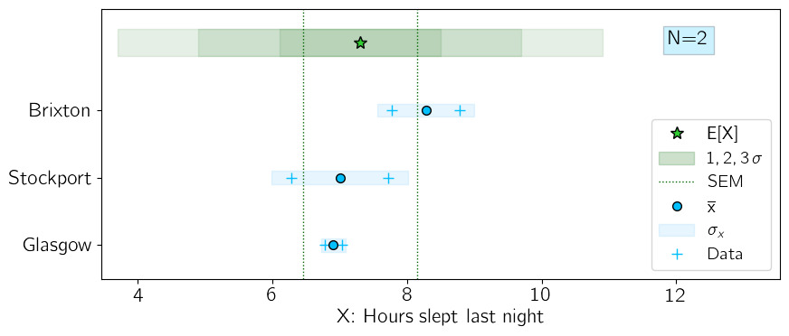
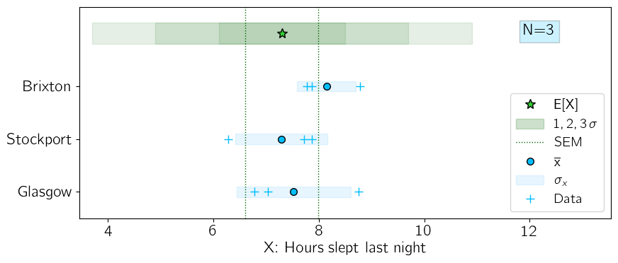
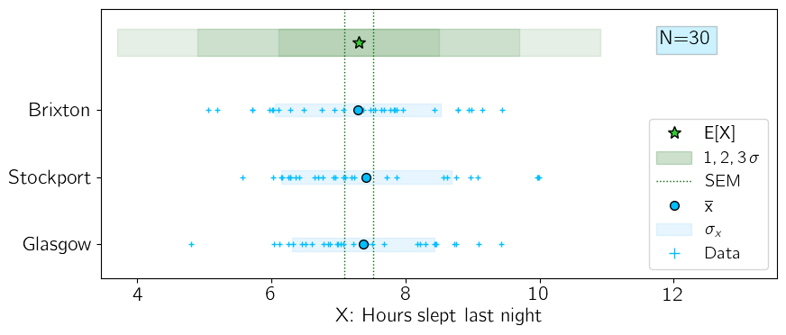
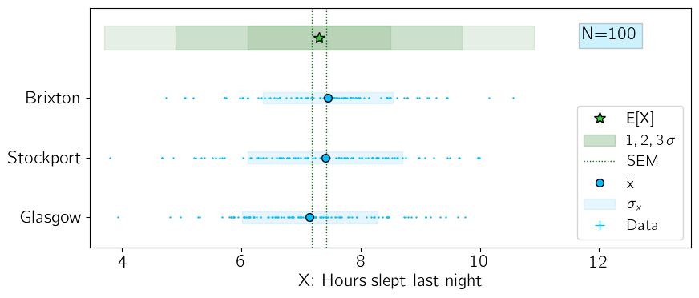
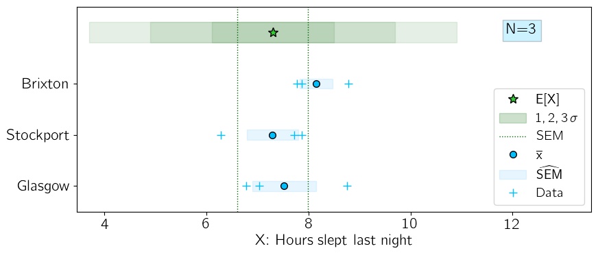
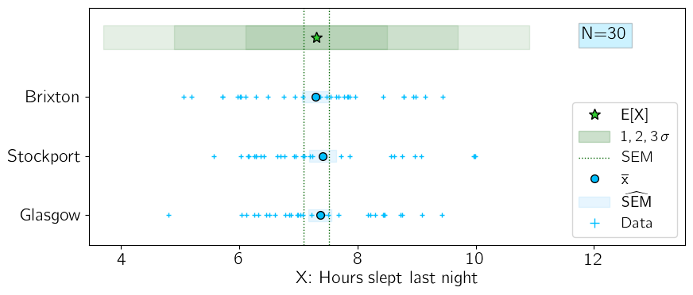
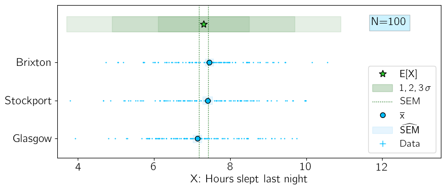
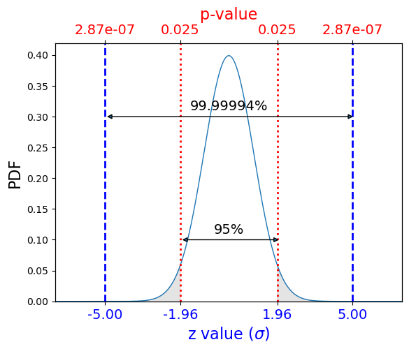
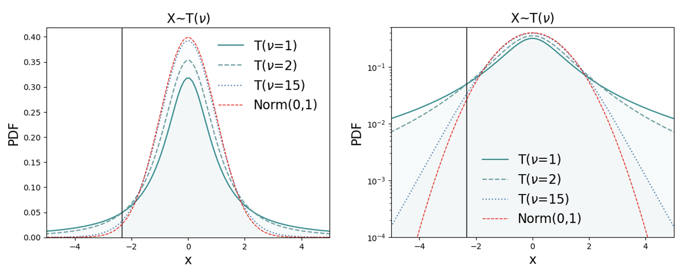
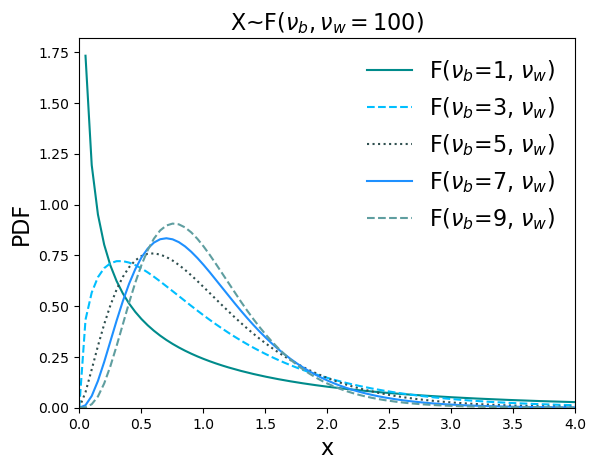

---
jupytext:
  formats: md:myst
  text_representation:
    extension: .md
    format_name: myst
kernelspec:
  name: python3
  display_name: 'Python 3'
---

(chapter:normtest)=
# Normal Tests

Normal Tests compare the mean or variance with a dataset with that of a hypothesis (Z,T) or another dataset (T2, F). We will explore this using a "Three Cities" dataset I faked. 

* ```numpy``` methods: ```random.seed, random.choice```
* ```scipy.stats``` methods: ```t,f```


## Distribution of Means

Real world measurements do not have infinite datasets. One consequence of this is that the variance in our small datasets will not accurately reflect the true variance of the underlying PDF.

<!--A set of 50 measurements of X will have some mean, $\overline{x}$, which is a summary statistic of the measurements. A different set of 50 measurements of X will have some other mean, because real world measurements are samples from a distribution (PDF or PMF) of an infinite number of measurements, languishing in the theoretical universe.-->

We know from the [CLT](#CLT) that if we measure the mean from many independent samples, then plot the measured means, we will get a Gaussian distribution (given large enough sample sizes, although the  $N\rightarrow \infty$ criterion in the CLT is clearly impossible to achieve in real life!).

<!--Note: I am using $N$ to denote the size of each sample, which is what the CLT cares about. I am using $n$  for the number of samples, which is the number of means we will have to plot.-->

**Example**:

I have $n=80$ employees, and send each of them to a different town in the UK and ask each of them to record the number of text messages sent in the last day by $N=50$ adult women, randomly selected on the streets. At the end of this endeavour, each employee will have an [IID](#IID) sample with some mean and variance, such that my combined sample will be formed of $n=80$ means. The distribution of these mean values will resemble a Gaussian, even though the sample sizes were $N=50$, which is nowhere near the $N\rightarrow \infty$ suggested by the CLT.

> **IID Reminder**:  They are **Independent**, because the mean measured in Stockport will have no effect on the mean measured in Brixton.  They are **Identically Distributed** because we are asking the same question everywhere: how many texts have you sent in the last 24H.


**Question**:  How confident are we in this resulting Gaussian-like distribution of means?


If I did this exact same experiment again on a different day in 80 other towns, I would not get exactly the same distribution of means. Would the mean of my resulting distribution be fairly stable, or would it be likely to fluctuate significantly? If the variable is IID, then this depends only on the number of people asked (in each town) $N$.

We quantify the uncertainty on the mean of the Gaussian using the [**Standard Error on the Mean (SEM)**](#sem).


### Expectation $E[\overline{x}] = E[X]$

The mean of our measurements (yes, it is a mean of means), $\overline{x}$, will not be the same as the True Mean , E[X], but they will be similar according to the [LLN](#LLN).

We can [show](#eq:expect_mean) that the Expectation of (each of) the sample means E[$\overline{x}$] is equal to the True Mean E[X], where we have used [](#eq:expect_sum) for the second step.

```{math}
:label: eq:expect_mean

\begin{align*}

\mathsf{E\left[\,\overline{x}\,\right] }&
\mathsf{= E\left[\dfrac{1}{N}\sum\limits_i^N x_i\right] }
 &\;\; \mathsf{\textcolor{blue}{because} \;\;} 
& \mathsf{\overline{x}  = \frac{1}{N} \sum \limits_i^N x_i}\;\;\\

& = \mathsf{\dfrac{1}{N} \sum\limits_i^N E\left[ x_i \right] }
 &\;\; \mathsf{\textcolor{blue}{because} \;\;} 
& \mathsf{E[sum] = sum(E)}
\\
  & = \mathsf{\dfrac{1}{N} \sum\limits_i^N E[X] }
& \;\; \mathsf{\textcolor{blue}{because\;x_i\;are\; iid,\; so\;} \;\;} 
& \mathsf{E[x_i] = E[X]\; \forall\; x_i}
\\
  & = \mathsf{\dfrac{1}{N} N E[X]= E[X]}
\end{align*}

```


### Variance $v_{\overline{x}} = \dfrac{1}{N}V[X]$

The Standard Deviation of our measurements (the SEM) will also not be the same as the True Standard Deviation , and we don't expect it to ever be, even if each employee asks a million people, because they are different things. The SEM is the measured variation of the means, which will depend on $N$ (how many people each of my employees ask for their data), whereas the True Standard Deviation is a fixed value, a parameter of the underlying distribution.


We can show [](#eq:var_mean) that the Variance of the sample means $v_{\overline{x}} \equiv V[\overline{x}]$ is equal to the True Variance[X] divided by the number of measurements $N$, where we have used [](#eq:var_sumind) and [](#eq:var_multc).

<!--The Variance on the measured means is $\mathsf{V[\,\overline{x}\,] = \sigma^2_{\overline{x}} = \mathsf{SEM}^2}$.

The True Variance is $\mathsf{V[X] = \sigma^2_{true} }$.-->


```{math}
:label: eq:var_mean

\begin{align*}
\mathsf{V\left[\,\overline{x}\,\right] }&
\mathsf{= V\left[\dfrac{1}{N}\sum\limits_i^Nx_i\right] }
 &\;\; \mathsf{\textcolor{blue}{because} \;\;} 
& \mathsf{\overline{x}  = \frac{1}{N} \sum \limits_i^N x_i}\;\;\\

& \mathsf{=  \sum\limits_i^N V\left[ \dfrac{1}{N}x_i \right] }
 &\;\; \mathsf{\textcolor{blue}{because} \;\;} 
& \mathsf{V[sum] = sum(V)} \mathsf{\;for\;iid\;}x_i
\\
  & = \mathsf{\dfrac{1}{N^2} \sum\limits_i^N V[x_i] }
& \;\; \mathsf{\textcolor{blue}{because\;} \;\;} 
& \mathsf{V[ax] = a^2\,V[x]}
\\
  & \mathsf{= \dfrac{1}{N} V[X] }
& \;\; \mathsf{\textcolor{blue}{because\;} \;\;} 
& \mathsf{V[X] = \dfrac{1}{N}\,V[x_i]}
\\

\end{align*}

```


The [proof](#eq:var_mean) tells us that the variance on the measured means, $v_{\overline{x}} \equiv V[\overline{x}]$, is **smaller than the True Variance, V[X] by a factor $N$**.

```{math}
:label: eq:var_mean1

v_{\overline{x}} = \dfrac{1}{N} V[X]

```

<!--If my employees asked ten times as many people for their data, the means they get will be more reliable, and the variances would become ten times smaller.

The True Variance is irreducible. It is a property of the underlying PDF that lives in the theoretical universe.-->

The Variance on the  Means is a (linear) function of this True Mean, and also has a strong inverse dependence on the number of measurements we take. In a nutshell, **the more measurements we take, the smaller the uncertainty on our measurement becomes**.

(sem)=
### Standard Error on the Mean $\mathsf{SEM}$

The Standard Error on the Mean is the square root of the Variance on the sample means:

$$\label{eq:SEM} \mathsf{\mathsf{SEM} = \sigma_{\overline{x}}  = \dfrac{\sigma_{true} }{\sqrt{N}}    }$$


This is an important result for Normal Tests, as we shall see.

```{card} $\sigma_x$ and $\sigma_{\overline{x}}$
The difference between $\sigma_x$ and $\sigma_{\overline{x}}$ is of crucial importance!

* $\sigma_x$ is a summary statistic for the sample, telling us how much variability is within the sample. 

* $\sigma_{\overline{x}}$ is not a summary statistic; it is a theoretical statistic, and it tells us how precise our mean measurement will be for a given number of measurements, N , and a true underlying variability, $\sigma_{true}$.
```


## Worked Example: A Tale of Three Cities

Let's consider the data displayed in [](#fig:sem1) below. This is simulated data for a scenario where I have asked people in three different cities to collect data on the number of hours slept the previous night. In this example, each of them have asked N=2 people.

:::{figure} 
:label: fig:sem1


My fake data for the hours slept each night in three cities, with $N=2$. The green star and shaded bar at the top shows the true distribution I used to generate the data. I used Norm( $\mu$ =7.5H , $\sigma$=1.2H). The blue crosses show the data points, the circles show their means, and the shaded blue-grey bars show the $1\sigma$ ranges.

:::

**Observations**:

The two people asked in Glasgow both gave very similar answers, which has resulted in a small [standard deviation](#eq:std) on the Glasgow sample. **Using the standard deviation for the shaded "error" bar is misleading** - it suggests that we have more confidence in the Glasgow measurement, when in fact they are all statistically equivalent in their uncertainty, which is large.

This becomes apparent as we take more data, and the means start to approach the expected value of 7.5 H. The mean number of hours slept in three different cities, using sample sizes of 3, 30, and 100, are shown in [](#fig:sem2), [](#fig:sem3), and [](#fig:sem4) respectively. The blue shaded bars represent the standard deviations on the samples, which is **not** a good estimate for the uncertainty on the mean, as it represents the range in which 68\% of the data fall. 


:::{figure} 
:label: fig:sem2


Fake data, N=3.
:::

:::{figure} 
:label: fig:sem3


Fake data, N=30.
:::

:::{figure} 
:label: fig:sem4


Fake data, N=100.
:::


We have two problems:

1. How do we factor in our increased confidence as the number of measurements increases?

2. How to we express the uncertainty on the mean when we have a tiny number of measurements?


### The Uncertainty on the Mean

The solution to problem 1 is to use the [SEM](#eq:SEM), but we must assume we do not know the true standard deviation  $\sigma_{true}$ and instead use the measured sample standard deviation $\sigma_{x}$  as our best **Estimate** of the SEM[^estimators].

[^estimators]: we will cover estimation at length later.

 $\mathsf{SEM} =  \dfrac{\sigma_{true} }{\sqrt{N}}$: the Standard Error on the Mean requires knowledge of the true standard deviation.

 $\mathsf{\widehat{SEM}} =  \dfrac{\sigma_{x} }{\sqrt{N}}$: the **Estimated** Standard Error on the Mean is denoted with a hat symbol $\widehat{}$ .


I have replaced the standard deviation with the $\mathsf{\widehat{SEM}}$ for the blue shaded barsin the  plots for [N=3](#fig:sem5), [N=30](#fig:sem6), and [N=100](#fig:sem7).[^estsem]

[^estsem]: $\mathsf{\widehat{SEM}}$ is a good estimate for the uncertainty on the mean if the sample size is not very small. A rule of thumb for "very small" is $N \lessapprox 30$. 


:::{figure} 
:label: fig:sem5


Fake data, N=3, with the shaded blue bar now giving what would be a sensible estimate of the uncertainty if we weren't suffering from such devestatingly small dataset [](#sosmall).
:::

:::{figure} 
:label: fig:sem6


Fake data, N=30, with the shaded blue bar now giving a sensible estimate of the uncertainty.
:::

:::{figure} 
:label: fig:sem7


Fake data, N=100, with the shaded blue bar now giving a sensible estimate of the uncertainty.
:::


(sosmall)=
### Small Datasets


Using the estimated SEM does not help us with tiny samples. A standard deviation from 2 or 3 measurements is not going to be accurate, and the SEM is just the standard deviation reduced in size by a factor $\dfrac{1}{\sqrt{N}}$, making it even more misleading than $\sigma_x$ for small sample sizes.


If we have only a handful of measurements, and there is no way to collect more data, how should we express the uncertainty on the mean?

**Option 1 - Don't do this**
: I will simply quote my raw measurements, making it clear there are only N, and let the reader decide the uncertainty.

  Dangerous! Almost everyone has almost no understanding of statistics and uncertainty. Because it is both hard and boring :).

**Option2 - The Frequentist Approach**
: I cannot know my uncertainty from such a small sample, so I will not share the incomplete measurement of the mean.

  Sad but safe.

**Option3 - The Bayesian approach**
: Use "common sense": my own experience of sleeping tells me that there can be natural +/- 1.5 H fluctuations on the number of hours I sleep each night. I expect that this could be as high as +/- 3H  in some people. I will use $\mathsf{\widehat{\sigma} = \mathsf{3H}}$. 
  
  Less sad and safe than the frequentists' "abstinence" approach, but reasonable in my opinion, given the very conservative (over-inflated, really) estimate. And it just feels wrong to not share my data at all, given that there is some limited information in it.

(data:threecities)=
## Three Cities Data

::::{dropdown} Show Code

```{code-cell} python
import numpy as np
np.random.default_rng()
from scipy.stats import norm

def three_cities_data( reproducible=True ):

    if reproducible:
        np.random.seed(42)

    #--------------------------------------------------------------------------------------------#
    # Parameters for Normal distribution in theoretical universe with infinite data points
    #--------------------------------------------------------------------------------------------#
    
    mu    = 7.33
    sigma = 1.21
 
    dist = norm(loc=mu, scale=sigma)

    # Number of fake people asked
    sample_sizes = [2, 3, 10, 30, 100, 3_000]

    iterations = range( len(sample_sizes) )

    # Difference between subsequent sample sizes eg 3-2=1, 10-3=7
    size_inc     = [ j-i for i, j in zip( sample_sizes[:-1], sample_sizes[1:] ) ]
    
    # want first number to be 2 for our N=2 sample
    size_inc.insert(0, 2)

    #-----------------------#
    # Fake data for Brixton
    #-----------------------#
    B_data1 = dist.rvs(size = max(10_000, max(sample_sizes) ) )  
    B_data = []

    #-----------------------#
    # Fake data for Stockport
    #-----------------------#
    S_data1 = dist.rvs(size = max(10_000, max(sample_sizes) ) ) 
    S_data = []

    #-----------------------#
    # Fake data for Glasgow
    #-----------------------# 
    G_data1 = dist.rvs(size = max(10_000, max(sample_sizes) ) )
    G_data = []

    #-----------------------#
    # Loop over sample sizes
    #-----------------------#   
    for i in iterations:
       
        N = sample_sizes[i]
        Nplus = size_inc[i]

        # randomly draw N **additional** fake measurements

        for j in range(Nplus):
        
            B_data.append(np.random.choice(B_data1,  replace=False) )
            S_data.append(np.random.choice(S_data1,  replace=False) )
            G_data.append(np.random.choice(G_data1,  replace=False) )

    return mu, sigma, B_data, S_data, G_data

```
::::

Run the function ```three_cities_data``` to generate datasets of different sizes for Brixton, Glasgow, and Stockport. We will use the data for the tests below.

:::{warning}
If you set ```reproducible = False```, you will not find the same values for the test statistics we calculate below, because you will have pulled different random samples.
:::

```{code-cell} python

reproducible = True
true_mu, true_sigma, B_data, S_data, G_data = three_cities_data(reproducible)

print(f" true_mu = {true_mu}, true_sigma={true_sigma}")

```

 


## The Z Test: compare data mean with hypothesis mean

**Example usage**
: Test if the sample mean $\overline{x}$ equals a hypothesised mean $\mu_0$.

**Restrictions**
: Data are $\mathsf{X\sim Norm(\mu,\sigma)}$
  True Variance $\sigma^2$ is known[^wot].


[^wot]: Why on earth would we know the true variance? This is very unrealistic, so is not used irl. But this is the "official" definition, so I am sharing it with you as-is.

Recall that the [Z value](#eq:z) for a measurement x tells us how many standard deviations ("sigmas") away from the mean that value is.

The Z Test defines this statistic slightly differently, because we no longer want to compare a measurement (x) to a summary statistic ($\overline{x}$). Now, we want to compare a summary statistic ($\overline{x}$) to a hypothesis ($\mu_0$):

```{math}
:label: eq:zstat

\mathsf{Z\; Test\; Statistic = \dfrac{ \overline{x}-\mu_{_0} }{ \mathsf{SEM}} }

```

<!--The measurement (x) is replaced with the sample mean, $\overline{x}$,  and the reference ($\overline{x}$) is replaced with the True Mean of the Null Hypothesis $\mu_0$ with which we are comparing our data. It would not make sense to use the sample standard deviation in the denominator, because we are comparing means rather than values, so the correct thing to use in the denominator is the SEM.-->

(ZTestExample)=
### Z Test Example: Hours slept in Stockport

::::{dropdown} Show Z Test Example

```{code-cell} python
# remind ourselves of the truth behind our three_cities sampling
print(f" true_mu = {true_mu} ")

```


**Null Hypothesis:**
: $H_0$: the mean number of hours slept by adult women is $\mathsf{\mu_0 = 7.33\,H}$.

**Research Question:**
: Is the mean sleep achieved by residents of Stockport equal to that predicted by the **Null Hypothesis**?


````{card} [1] Design Test
- Significance Level : $\alpha=0.05$
- Alternate hypothesis, $H_1$:  $\mathsf{\mu_0 \textcolor{red}{\neq} 7.33\,H}$ : this means the test is two-sided.

```{code-cell} python
alpha  = 0.05
nsided = 2
```

````

````{card} [2] Look at Data:

```{code-cell} python
alpha = 0.05
N = 100

# pull the N=100 dataset from the Stockport data
data = S_data[:N]

mean = np.mean(data)
var = np.var(data,ddof=1)

```

````


````{card} [3] Calculate [Test Statistic](#eq:zstat)

Z Test Statistic:

$Z = \dfrac{ \overline{x}-\mu_{_0} }{\mathsf{SEM}}$

The denominator is calculated as:

$\mathsf{SEM} = \sigma_{\overline{x}}  = \dfrac{\sigma_{true} }{\sqrt{N}}$

<!--
We don't know $\sigma_{true}$, so we **Estimate** the SEM rather than calculating it [^note1]:

$\mathsf{ \widehat{SEM}} =\dfrac{\sigma_{x} }{\sqrt{N-1}}$[^note2]
-->


```{code-cell} python
sem = true_sigma / np.sqrt(N)

Zstat = (mean - true_mu) / sem

print(f" Z = {Zstat:.2f}")

print(f"Our data mean {mean:.2f} is {Zstat:.2f} sigmas from the null hypothesis true mean, {true_mu:.2f}")

```

````


<!--
$\mathsf{V[X] = \dfrac{N}{N-1}\; V[x]}$
: The true variance V[X] is slightly underestimated by the sample variance V[x].

$\mathsf{\sigma_{true} = \sqrt{ \dfrac{N}{N-1}}\; \sigma_{x}}$
: The standard deviation is the square root of the variance.

$\mathsf{\dfrac{\sigma_{true}}{\sqrt{N}} =  \dfrac{1}{\sqrt{N}} \dfrac{\sqrt{N}}{\sqrt{N-1}}\; \sigma_{x}
=  \dfrac{\sigma_{x}}{\sqrt{N-1}}\; }$
: We recover our Unbiased Estimate of the True Variance.
-->


<!--An estimated  test statistic of 0.538 means that our data mean is 0.538 standard deviations above the value the Null Hypothesis claims is the true mean.-->


The final step is to [convert this into a p value](#pfromz) that we can use directly to reject or not-reject $H_0$.

```{code-cell} python
from scipy.stats import norm

# the two-sided p-value is 2* the survival function
p_value = nsided * norm.sf( abs(Zstat) )

print(f"P value: {p_value:.2f} (2sf)")

if(p_value > alpha):
	print(f" => Test Negative, we do not reject the null hypothesis")
else:
	print(f" => Test Positive, we reject the null hypothesis!")

```

> It may be helpful to keep a reference such as [](#fig:pvalzval) to hand to help with getting an understanding of how Z values and p values are related. It is very simple to convert one to another, but even better to have an instinct such as knowing a Z value of 0.5 puts us right in the peak of the normal distribution.

:::{figure} 
:label: fig:pvalzval


For a Normal distribution, the p value and Z value are different ways of stating the same information.
:::

::::

## The Student's T Test

The one-sample T Test is very similar to the Z Test, but is **particularly well suited to small datasets**. This is because instead of using the Normal distribution, it uses the Student's T[^student] distribution, which is like the Normal distribution but with fatter tails [](#fig:tpdf).

[^student]: William Gosset is the Student. He used a code name at his employers' (Guiness Brewery) request.

**Example usage**
: Test if the sample mean $\overline{x}$ equals a hypothesised mean $\mu_0$.

**Restrictions**
: Data are $\mathsf{X\sim Norm(\mu,\sigma)}$
  
Notice that unlike the Z Test, the T test is not restricted by the need to know the True Variance. 

In the (much more realistic) scenario where we don't know $\sigma_{true}$, we **Estimate** the [SEM](#eq:SEM) rather than calculating it[^note2]:

```{math}
:label: eq:est-sem
\mathsf{ \widehat{SEM}} =\dfrac{\sigma_{x} }{\sqrt{N-1}}
```


The T distribution has one parameter: the number of degrees of freedom, with symbol [$\nu$](#eq:Tnu). 

```{math}
:label: eq:Tnu
\nu = N - N_{pars}
```


The T PDF $\nu=1$ corresponds to a sample size of $N=2$, because we are measuring a single parameter, the mean, $N_{pars}=1$. For reasonably sized datasets of $N \gtrapprox 30$, the T distribution and Norm are barely distinguishable.


:::{figure} 
:label: fig:tpdf


The T PDF for different values of the parameter $\nu$ (Number of degrees of freedom) on a linear scale (left) and on a log scale (right). The standard normal distribution Norm(0,1) is also shown as a red dashed line.
:::


### T Test Example: Hours slept in Brixton

::::{dropdown} Show one-sample T Test Example

**Null Hypothesis:**
: $H_0$: the mean number of hours slept by adult women is $\mathsf{\mu_0 = 7.33\,H}$.

**Research Question:**
: Is the mean sleep achieved by residents of Brixton equal to that predicted by the **Null Hypothesis**?


````{card} [1] Design Test
- Significance Level : $\alpha=0.05$
- Alternate hypothesis, $H_1$:  $\mathsf{\mu_0 \textcolor{red}{\neq} 7.33\,H}$ : this means the test is two-sided.

```{code-cell} python
alpha  = 0.05
nsided = 2
```

````

````{card} [2] Look at Data:

```{code-cell} python
alpha = 0.05
N = 3 # <- tiny!

# pull the N=3 dataset from the Brixton data
data = B_data[:N]

mean = np.mean(data)
var = np.var(data,ddof=1)
sigma = np.std(data,ddof=1)
```

````

````{card} [3] Calculate [Test Statistic](#eq:zstat)

T Test Statistic, using the [Estimated SEM](#eq:est-sem):

$T = \dfrac{ \overline{x}-\mu_{_0} }{\mathsf{ \widehat{SEM}}}$

The denominator is calculated as:

$\mathsf{ \widehat{SEM}} = \widehat{\sigma_{\overline{x}}}  = \dfrac{ \sigma_{x} }{ \sqrt{N-1} } $


```{code-cell} python
est_sem = sigma / np.sqrt(N-1)

Tstat = (mean - true_mu) / est_sem 

print(f" T = {Tstat:.2f}")

print(f"Our data mean {mean:.2f} is {Tstat:.2f} sigmas from the null hypothesis true mean, {true_mu:.2f}")

```

````

To [convert this into a p value](#pfromz) we use python again, taking care to use the T distribution rather than the Normal distribution: 

```{code-cell} python
from scipy.stats import t # <= t is scipy stats name for the T distribution

# for norm.sf we passed only Z, but for t we must also pass the parameter nu of the T PDF, which is 3-1=2 for this N=3 dataset.

p_value = nsided * t.sf( abs(Tstat), df = N-1 ) # <= df is scipy's name for the parameter nu

print(f"P value: {p_value:.2f} (2sf)")
if(p_value > alpha):
	print(f" => Test Negative, we do not reject the null hypothesis")
else:
	print(f" => Test Positive, we reject the null hypothesis!")


```

::::

## The Student's T Test: two samples

The two-sample T Test is for comparing two datasets, rather than one dataset and a hypothesis.


**Example usage**
: Test if two samples $x$ and $y$ have the same mean.

**Restrictions**
: Data are $\mathsf{X\sim Norm(\mu,\sigma)}$
  
  The samples should have roughly equal variances, $0.5 < \dfrac{\sigma_x}{\sigma_y} < 2$.


```{math}
:label: eq:T2test
\mathsf{T_2\; test= \dfrac{ \overline{x}-\overline{y} }{\psi\,\sigma_{p}}}
```

The **Pooled Variance** $\sigma^2_p$ is constructed from the Unbiased Variances of the two datasets, $\sigma^2_{x}$ and $\sigma^2_{y}$, and the degrees of freedom in each, $\nu_x$  and $\nu_y$:

```{math}
:label: eq:pooledvar
\mathsf{ \sigma^2_p = \dfrac{\nu_x \,\sigma^2_{x} + \nu_y \, \sigma^2_{y}}{\nu_x + \nu_y} }
```

The Multiplier $\psi$ ("psi") in the denominator of the [test statistic](#eq:T2test) is:

```{math}
:label: eq:psi
\mathsf{\psi =\sqrt{ \dfrac{1}{N_x} + \dfrac{1}{N_y} }}
```

We can use this test statistic when sample sizes are equal or unequal, and have similar variances, as in our case. I will put a note at the bottom of this section about what to do if your datasets have very different variances[^welch].

[^welch]: We will use a modified "Welch's T test" 

[//]: # ( https://canvas.sussex.ac.uk/courses/37537/pages/13-normal-tests)


### Two-sample T Test Example: Glasgow versus Brixton

::::{dropdown} Show two-sample T Test Example

**Null Hypothesis:**
: $H_0$: the mean number of hours slept in Glasgow and Brixton are the same.


````{card} [1] Design Test
- Significance Level : $\alpha=0.05$
- Alternate hypothesis, $H_1$:  Glaswegians sleep less than Brixtonians : this means the test is one-sided.

```{code-cell} python
alpha  = 0.05
nsided = 1
```

````

```{card} [2] Look at Data. Brixton: $x$, Glasgow: $y$
- Sample means: $\overline{x} = \mathsf{7.60\,H}$, $\overline{y} = \mathsf{7.44\,H}$
- Sample variances: $v_x = \mathsf{1.19\,H^2}$, $v_y = \mathsf{0.91\,H^2}$,
- Sample sizes: $N_x=10$, $N_y=10$
```

````{card} [2] Look at Data:

```{code-cell} python
alpha = 0.05
NB = 10 
NG = 10 

# pull the N=10 dataset from the Brixton and Glasgow datasets
dataB = B_data[:NB]
dataG = G_data[:NG]

# mean and variance for Brixton
meanB = np.mean(dataB)
varB = np.var(dataB,ddof=1)

# mean and variance for Glasgow
meanG = np.mean(dataG)
varG = np.var(dataG,ddof=1)

nuG = NG-1
nuB = NB-1

```

````


````{card} [3] Calculate the pooled variance, the multiplier, the test statistic, and the p value


First, the pooled variance:
```{math}
:enumerated: false

\mathsf{ \sigma^2_p = \dfrac{\nu_x \,\sigma^2_{x} + \nu_y \, \sigma^2_{y}}{\nu_x + \nu_y} }
```

```{code-cell} python
var_p = ( nuG * varG + nuB * varB ) / (nuG + nuB)

print(f" Pooled variance = {var_p}")
```


Next, the multiplier:
```{math}
:enumerated: false
\mathsf{\psi =\sqrt{ \dfrac{1}{N_x} + \dfrac{1}{N_y} }}
```

```{code-cell} python
psi = np.sqrt( 1/nuG + 1/nuB)

print(f" Multiplier = {psi}")
```


The test statistic:
```{math}
:enumerated: false
\mathsf{T_2\; test= \dfrac{ \overline{x}-\overline{y} }{\psi\,\sigma_{p}}}
```

```{code-cell} python
T2 = ( meanB - meanG ) / (psi * np.sqrt(var_p))

print(f" T2 statistic = {T2}")
```

And finally the p value:

```{code-cell} python
from scipy.stats import t

p_value = nsided * t.sf(T2, df=nuB+nuG) 

print(f"P value: {p_value:.2f} (2sf)")

if(p_value > alpha):
	print(f" => Test Negative, we do not reject the null hypothesis")
else:
	print(f" => Test Positive, we reject the null hypothesis!")

```

::::


## The F Test (one-way ANOVA)

Another way to compare groups is via ANalysis Of VAriance. The F test statistic is defined as the ratio:

```{math}
:label: eq:fstat

\mathsf{F\;test\;statistic =Variance\; Between\; groups \bigg/Variance\; Within\; groups}

```

### The Variance Between groups

We will compare two datasets (groups): $x$ and $y$. The combination of both datasets is $g$, such that both $x$ and $y$ are subsets of $g$.

1. We calculate the squared difference in the mean of the subset $x$ and the mean of the set $g$:  $\mathsf{\Delta^2_{xg} = (\overline{x} - \overline{g})^2 }$

2. Do the same for the other subset $y$: $\mathsf{\Delta^2_{yg} = (\overline{y} - \overline{g})^2 }$

3. Add these terms together, "weighted" by their numbers of measurements: $\mathsf{N_x\Delta^2_{xg}  + N_y\Delta^2_{yg} }$

4. Divide by the number of degrees of freedom between the subsets: $\mathsf{\nu_{between} = N_s-1}$ where $N_s$ is the number of subsets. In the case of two samples, $N_s =2$, so there is only one degree of freedom between the subsets and this step has no effect, but generally the number of subsets can be more than two.

In this case we find $\mathsf{ V_{between} = \dfrac{\,N_x\Delta^2_{xg}  + N_y\Delta^2_{yg} \,}{\,N_s -1} }$

The general formula is:
```{math}
:label: eq:varbetween
\mathsf{
V_{between} = 
\dfrac{
\sum_{j} N_j\, \Delta_{jg}^2
}{
N_s-1 
}
}
```

> The number of degrees of freedom between the subsets in the group, $\mathsf{\nu_{between} = N_s -1}$, depends only on the number of subsets, not on the sample size(s).

The **Variance Between** subsets of data is sometimes referred to as the **Explained Variance**.


### The Variance Within groups

The Variance Within is the weighted sum of the unbiased variances, divided by the sum of their numbers of degrees of freedom.

1. Calculate the weighted sum of squared deviations for each subset:

```{math}
:label: eq:ws1
\mathsf{ (N_x -1)v_x = \displaystyle{\sum\limits_i^{N_x} (x_i - \overline{x})^2} }
```

```{math}
:label: eq:ws2
\mathsf{ (N_y -1)v_y = \displaystyle{\sum\limits_i^{N_y} (y_i - \overline{y})^2} }
```

2. Divide by the number of degrees of freedom within the subsets: $\mathsf{\nu_{within} = N_x + N_y - N_s}$

<!--Note that this is the same as summing the number of degrees of freedom within each subset.-->

In this case we find: $\mathsf{ V_{within} = \dfrac{ (N_x-1)v_x  + (N_y-1) v_y }{\,N_x + N_y -N_s } }$


The general formula is:
```{math}
:label: eq:varwithin
\mathsf{
V_{within}=
\dfrac{
\sum_{j} (N_j -1) \,V[x_{(j)}]
}{
\sum_{j}  N_j - N_s
}
}
```

<!--:::{tip}Notation
 In the general form for $N_s$ subsets of size $N_j$, the subsets are represented by $\mathsf{x_{(j)} = x,y,...}$. It is common to use parentheses in the subscript $\mathsf{ x_{(j)} }$  for a variable, to distinguish it from \mathsf{ x_{i} } which is used for individual values of that variable. $\mathsf{x_{(j)} }$ would be an array of all the \mathsf{ x_{i} } values.
:::-->


The denominator $\mathsf{ \sum \limits_{j}  N_j - N_s}$  is the number of degrees of freedom within the subsets in the group, $\mathsf{ \nu_{within} }$. Note that this depends on both the number of subsets (2 in our example) and on the sample sizes.

We now have the ingredients to calculate the **F statistic**:

```{math}
:label: eq:ftest
\mathsf{ F = V_{between} \; / \; V_{within} }
```

### The F PDF

The F PDF is shown in [](#fig:fpdf) for cases where we have between 2 and 10 subsets, such that the variance between, $\nu_b = N_s -1 $, ranges from 1 to 9.

:::{figure}
:label: fig:fpdf


Notice that the F PDF is **asymmetric**, unlike the normal and T distributions. The number of degrees of freedom within the subsets is the same in each case, $\mathsf{ \nu_{within} = \sum \limits_{j}^{ N_{s}}  N_j - N_s =100}$. <!--With one degree of freedom between the samples (as in the case of comparing two samples, as $\mathsf{\nu_{between} = N_s-1}$ ), the F test statistic grows exponentially for F statistic values approaching zero.-->

:::


### Two-sample F Test Example: Glasgow versus Brixton


::::{dropdown} Show two-sample F Test Example

**Null Hypothesis:**
: $H_0$: the mean number of hours slept in Glasgow and Brixton are the same.


```{card} [1] Design Test
- Significance Level : $\alpha=0.05$
- Alternate hypothesis, $H_1$: Glaswegians sleep less than Brixtonians : this means the test is one-sided.
```

**This one I have left for you to pythonise and find the F statistic and p value Go ahead and try it using the examples above**. You will want to use the [f distribution](https://docs.scipy.org/doc/scipy/reference/generated/scipy.stats.f.html) for the p value.


:::{tip} Eyeballing
Note that we can eyeball the PDF plot above (the closest one to our situation is $\mathsf{\nu_b =1, \nu_w=100}$ ) to get a rough idea of whether we were going to be close to rejecting $H_0$. An F statistic of 0.108 leaves a big fat tail to the right which clearly has more than 5% of the distribution in it, so I would have guessed we were not in the ballpark for a positive result.
:::


::::

[^thiscase]: In this special case, our samples are the same size, so we can just take the mean of the two means. In general we would have to combined the datasets or calculated the weighted mean.]

## Notes


:::{figure}
:label: fig:lilyproof_varbias


Proof that the sample variance is a biased estimator for the true variance.
:::


