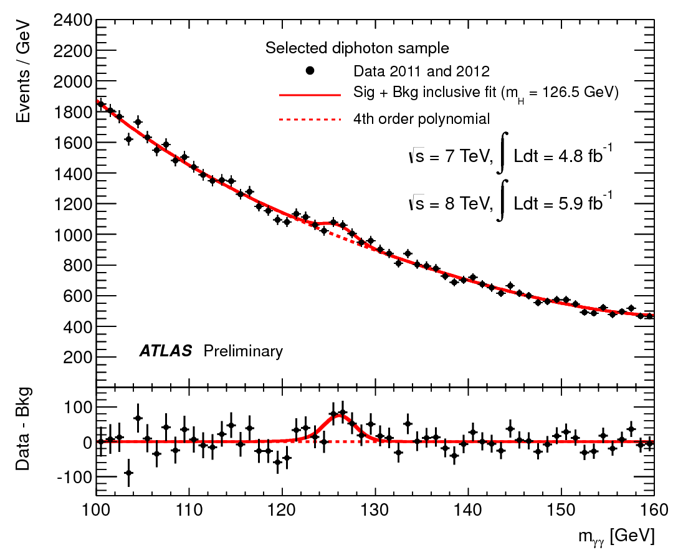
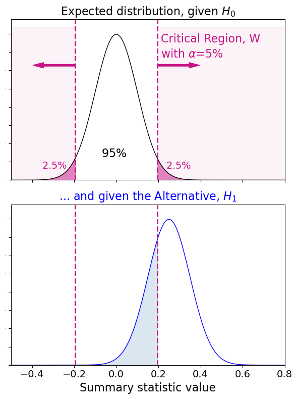
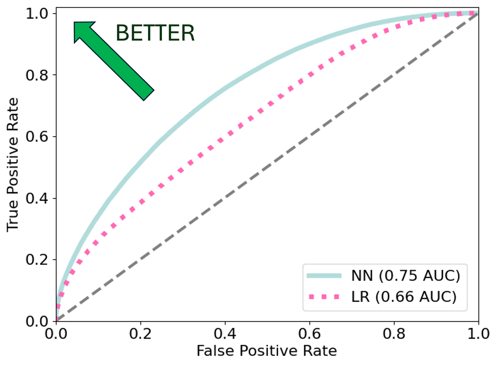
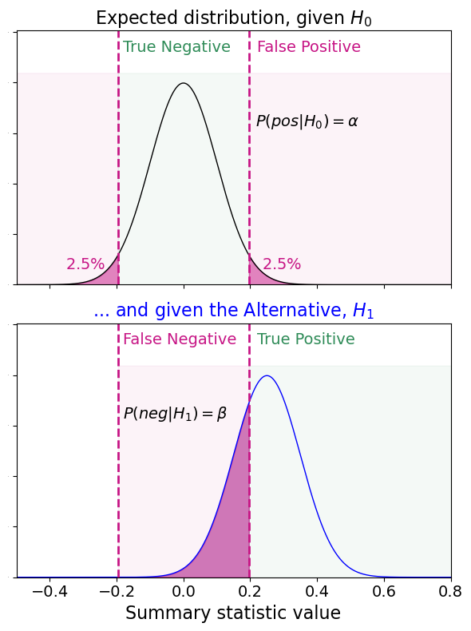
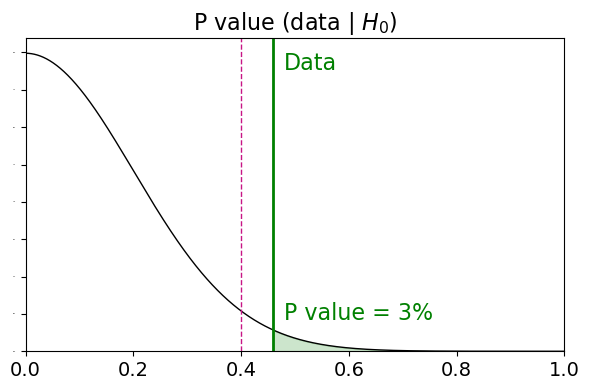
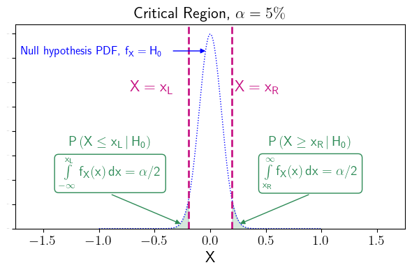
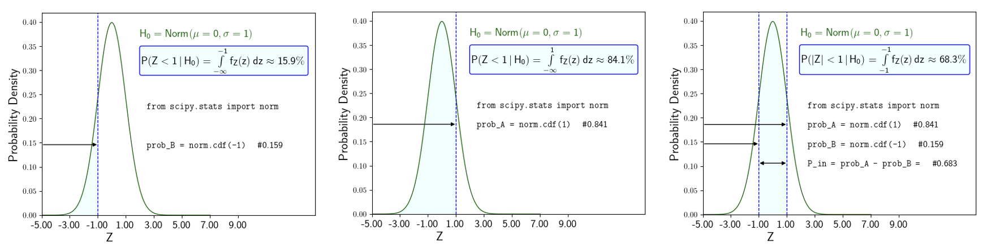
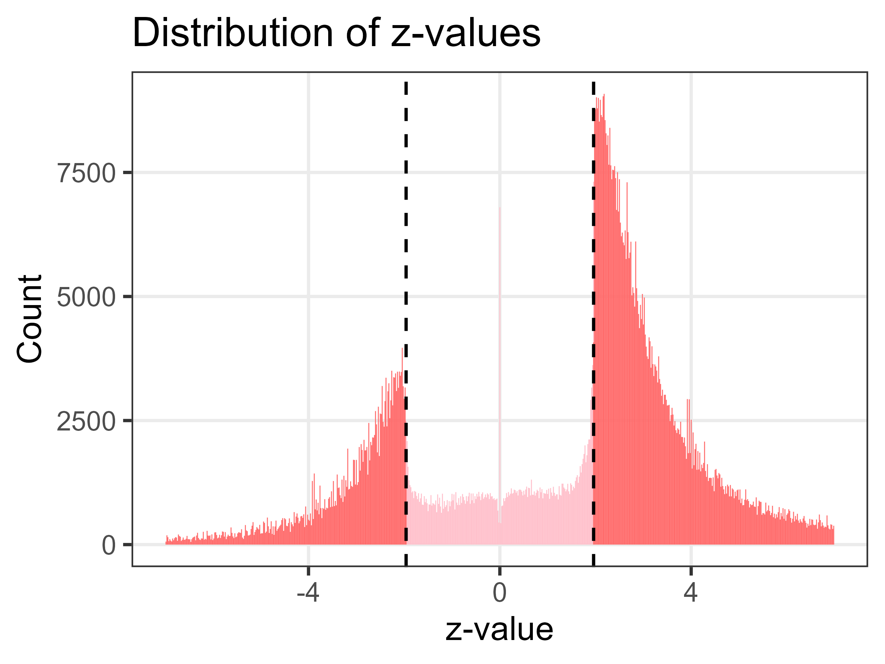

---
jupytext:
  formats: md:myst
  text_representation:
    extension: .md
    format_name: myst
kernelspec:
  name: python3
  display_name: 'Python 3'
---

# Hypothesis Tests

## Hypotheses

A Hypothesis is an educated guess at the explanation for some occurrence. It must
be based on real observations and it must be testable.

Example
: if I collect some data (and I do not know the underlying PDF) I may
observe that it looks like eg exponential decay when I plot it, but it has some lumps and bumps, so something more interesting could possibly be going on...

The **Null Hypothesis** $H_0$
: is the educated guess that the most obvious (boring?)
explanation for the data is the correct one. For the example above, the Null
Hypothesis could be that the data is indeed $\sim$Expon($\lambda$)[^probs].

[^probs]: The notation $\sim$ Expon($\lambda$) means "follows an exponential distribution". The parameter of the exponential distribution is $\lambda$. We will meet many distributions later and refer to them in this way: $\sim$ DistributionName(parameters) or $\sim$ DistributionName(parameter values).

The **Alternative Hypothesis** $H_1$
: is an alternative to $H_0$. For the example above, the Alternative Hypothesis would be that the lumps and bumps are exciting resonances that will win your research group a Nobel prize and pay for a new espresso machine.

### Example: The Higgs

After waiting forever for the LHC to get going after some unfortunate stalls due to
bad soldering and a ferret, we started to see ‘Higgs-like’ signs in 2011. The plot in [](#fig:higgs) shows the Null Hypothesis (no Higgs) as a red dashed line and the Alternative Hypothesis (Higgs) as a solid red line. In this case, we were not able to disprove the Alternative Hypothesis, and we have still not been able to disprove it. When a particle physicist talks about Discovery (the D-word) we mean that we have not yet managed to exclude the alternative hypothesis.


:::{figure} 
:label: fig:higgs
:align: left


Higgs hunting, back in the day.
:::


## Designing a Test

### Bias

Anyone who has done [Harvard’s excellent
Unconscious Bias tests](https://implicit.harvard.edu/implicit/takeatest.html) will know that humans are hopeless at being unbiased, and hopeless at being aware of our biases.
If we are going to do excellent
science, and not just come up with whatever result
means we get a new espresso machine, **we have to
remove any chance of introducing bias**.
One way of doing this is to set out **very strict
criteria** for the **Hypothesis Test** before
we look at our data.

The two strict criteria for designing a statistical test that is not prone to bias:

1. Define a critical region, $W$
2. Choose a significance level, $\alpha$

:::{figure} 
:label: fig:espresso
:align: right
:width: 10%


A beautiful espresso machine.
:::


### Critical Region and Significance Level

A Critical Region $W$ is a region of the Sample Space $S$ in which the probability of finding the data, given the Null Hypothesis, is very small[^verysmall].

[^verysmall]: "very small" is a qualititive term, which will be defined quantatively as part of our test.

:::{figure} 
:label: fig:robot-critregion
:align: right
:width: 40%


A Robot showing their friends a simple critical region.
:::

The region $W$ can have any shape, making it suitable for tests involving multivariate data. The simplest possible definition of $W$ for univariate data would be to draw a vertical line (a ‘cut’) and define $W$ as being on one side of it, as illustrated by our robot friends in [](#fig:robot-critregion).

A **Positive Result** means that we have found our data x in the critical region, $W$, and so we **reject the Null Hypothesis**.

> Reminder: One cannot prove a hypothesis. Hypotheses can only be rejected or not rejected.


We stated above that $W$ is a region of the Sample Space in which the
probability of finding the data, given the Null Hypothesis, is **very small**. What does very small mean?

A popular choice in the wide world (but not in my world) is to set a tolerance level of $5\%$. We define our region $W$ such that there is a 5% or lower probability of finding the data in that region, given the null hypothesis $H_0$.

This tolerance level is called the **Significance Level, $\alpha$**, and it provides the upper limit on the conditional probablity in [](#eq:testW).


$$\label{eq:testW} P(x \in W | H_0) \leq \alpha $$


The **Confidence Level** is also set by our choice of $\alpha$, as 

$$\label{eq:cl} CL = 1-\alpha$$.


Once we when we have decided on $W$ and $\alpha$, we can look at (‘unblind’) our data.


**Choosing a Critical Region is challenging**


In reality, it is impossible to find a $W$ that is not consistent with both $H_0$ and $H_1$. There will always be overlap between them, as I have attemped to illustrate in [](#fig:critregion). 


:::{figure} 
:label: fig:critregion
:align: right
:width: 20%



A cartoon showing the PDFs for the Null (top) and Alternative (bottom) hypotheses.
:::

In the simplified example of [](#fig:critregion), the critical region that provides us with a significance level of $\alpha=5\%$ exludes more than half of the distribution for the Alternative Hypothesis. In life, we may find that our critical region eliminates much larger fractions of $H_1$. We need to think carefully about how we define our critical regions to ensure we mazimize our **Sensitivity** to the data. 

The **Sensitivity** of a test for a given $H_1$ is also called the **Power of the test**, and is determined by the proportion of $H_1$ not excluded by our choice of $W$ and $\alpha$: 

$$\label{eq:power} \mathsf{Power} = 1-\beta$$.


Defining a critical region involves carefully defining a test statistic[^examp] that minimizes the overlap between $H_0$ and $H_1$. Minimizing this overlap maximizes our sensitivity. We must also choose our significance level $\alpha$ in parallel with defining $W$.

[^examp]: The test statistic may be the output from a multivariate classifier, for example.

### The Hypotheses as Universes

Notice that [](#eq:testW) is a Conditional Probability. The Condition is $H_0$: we are conditioning on the Truth, which cannot be known by us.

We previously noted that the [True Underlying Distribution](#fig:theoretical-universe) lives in the Theoretical Universe. In our real, physical universe all we can do is look at statistically-limited (finite) samples from it.

When we consider a hypothesis, we are considering a theoretical universe in which that hypothesis is correct. The null and alternative hypotheses cannot both be correct in the same universe. So, when we design a test that is conditional on $H_0$, we are simply testing the compatibility of our data from the physical universe with one possible theoretical universe. The same goes for $H_1$ and any other Hypothetical Universe we care to think up. 

### Purity and Efficiency

The Purity and Efficiency are commonly used metrics in scientific data analysis.
Here is a simple definition of **Purity**:

```{math}
:label: eq:purity1

\mathsf{Purity} =  \dfrac{\mathsf{Number\; correctly\; classified\; as\; A}}{\mathsf{ Total\; number\; classified\; as\; A}}
```


Notice that the numerator uses the word "Correctly", which indicates we have knowledge of the Truth. 

Using a lower case symbol **a** for the classification and an upper case symbol **A** for the truth, we can write this definition of **Purity** more concisely:

```{math}
:label: eq:purity2

\mathsf{Purity}  =  \dfrac{\mathsf{ N(A \cap a) }}{\mathsf{ N(a)}}
```

Using the reasoning in [](#cond-prob), we can therefore write the purity as a Conditional Probability:

```{math}
:label: eq:purity3

\mathsf{Purity}  = P(A|a) 
```

[](#eq:purity3): the Purity is the probability of the truth being **A**, given that the classification is **a**.


Here is a simple definition of **Efficiency**:

```{math}
:label: eq:efficiency1

\mathsf{Efficiency} = \dfrac{\mathsf{Number\; correctly\; classified\; as\; A}}{\mathsf{ Total\; number\; that\; are\; truly\; A}}
```

The more concise form is:

```{math}
:label: eq:efficiency2

\mathsf{Efficiency} =  \dfrac{\mathsf{ N(A \cap a)} }{\mathsf{ N(A)}}
```

And as a conditional probability:

```{math}
:label: eq:efficiency3

\mathsf{Efficiency} = P(a|A) 
```
[](#eq:efficiency3): the Efficiency is the probability of the classification is **a**, given that the truth is **A**.


### Contingency Tables

A Contingency Table allows us to summarise the efficiency and purity of a test statistic in terms of the Truth: True/False and the Classification:Postive/Negative[^nonbin].

[^nonbin]: We are not limited to binary classification, just using the simplest form here.

:::{table} Contingency Table Example in terms of sets **A** (the truth) and **a** (classification).
:widths: auto
:align: center

|      | $a$   | $a'$  | 
| ---  | --- | --- | 
| $A$    | $a\cap A$  | $a'\cap A$  | 
| $A'$   | $a\cap A'$ | $a'\cap A'$ | 
:::


Example: I have 100 robots, 41 of whom were designed by my friend Alf.  I am attempting to predict which ones are Alf's design using their features. My classifier identifies 60 robots as being designed by Alf. Of these 60, 37 are in fact Alf's (my classifier was right), and 23 are not (my classifier was wrong). 

Summary:
* $N(a\cap A) = 37$
* $N(a\cap A') = 23$
* $N(a'\cap A) = 4$ (inferred, 41-37)
* $N(a'\cap A') = 36$ (inferred, 40-4)

Note that we are now able to fill out the whole table using the information above and basic logic. But just because the logic is "basic", doesn't mean that it is easy to get your head round making and using contingency tables. It takes practice.

:::{table} Contingency Table summarising the performance of my classifier.
:widths: auto
:align: center

|      | a   | a'  | Total |
| ---  | --- | --- | --- |
| **A**    | 37  | 4   | 41  |
| **A'**   | 23  | 36  | 59  |
| **Total**| 60  | 40  | 100 |
:::


For this example, the purity is calculated in [](#purity-alf) and the efficiency in [](#efficiency-alf). 

```{math}
:label: purity-alf

\mathsf{Purity} = P(A|a) = N( A\cap a) / N( a ) = 37/60 \approx 62\%

```


```{math}
:label: efficiency-alf

\mathsf{Efficiency} = P(a|A) = N( A\cap a) / N( A ) = 37/41  \approx 90\%

```


I would conclude that this classifier has quite good efficiency, as it misses only 10% of the Alf robots, but questionable purity, as it misclassifies a lot of non-Alfs as being Alf designs.


### The Purity versus Efficiency play-off

Choosing a small value of $\alpha$ in the construction of our [test](#eq:testW) results in high **purity** for $H_0$, meaning you are very unlikely to find the data in $W$ if $H_0$ is true. 

> Small $\alpha$ = high purity for $H_0$ = high [Confidence Level](#eq:cl) 

But, a smaller value of $\alpha$ is achieved by shifting the region such that we increase the overlap with  $H_1$, lowering the test's **efficiency** for the alternative hypothesis. The efficiency for $H_1$ is referred to as the **Power of the test**.

> Small $\alpha$ = low efficiency for $H_1$ = low [Power](#eq:power) 


<!--
The purity of our critical region W, which is designed to exclude the null hypothesis $H_0$, is the proportion of the region not overlapping with $H_0$:
$$
:label: purity-null
p_W = P( H_0' | W )  = 1-\alpha
$$-->


**If Efficiency (Power, sensitivity to $H_1$) is more important: choose larger $\alpha$**
: If you are **Statistically Limited** (suffering from a small dataset) you will probably try to maximise efficiency at the cost of purity. But, choosing a larger significance level $\alpha$ means the findings of your test are less significant, so less likely to be published or considered important. As such, it is often a good choice to gather more data, such that a stronger (smaller) choice of $\alpha$ can be used.


**Purity (Significance) is more important: choose smaller $\alpha$**
: There may be motivation to make $\alpha$ very small in an effort to make the critical region "Ultra Pure". The alternative hypotheses (there is often more than one of these) must be considered carefully for this decision, as we don't usually want to define a region $W$ that has been cleansed not only of $H_0$, but also most of $H_1$.


When we are designing a Test Statistic, which might be a ML Classifier for example, a useful plot to make is called a **ROC Curve**. This is a plot of the True Positive Rate (TPR) versus the False Positive Rate (FPR) for a given Alternative Hypothesis[^equiv]. An example ROC curve is shown in [](#fig:roc)

[^equiv]: one could also choose to make a ROC curve in terms of the True Negative Rate and False Negative Rate, if preferred.

:::{figure} 
:label: fig:roc


A ROC curve summarising the performance of two different classifiers, NN and LR, in terms of their True Positive and False Positive Rates.
:::

Let's label a positive classification as **a**, and a negative classification as **a'**.

We will use **A** to indicate that the truth is $H_1$, and **A'** to indicate that the truth is $H_0$.


The **True Positive Rate (TPR)** can then be written as [](#eq:tpr):

```{math}
:label: eq:tpr

TPR = \dfrac{N(a \cap A)}{N(A)} = P(a|A)
```

The **False Positive Rate (FPR)** is [](#eq:fpr):

```{math}
:label: eg:fpr

FPR = \dfrac{N(a \cap A')}{N(A')} = P(a|A')
```
<!--
:::{figure} 
:label: fig:robot-critregion
:align: right
:width: 40%


A Robot showing their friends the overlap between the null and alternative hypotheses.
:::
-->


<!--Is purity or efficiency more important to
you? High purity means small α(small
contamination) and lower power (you have
cut out a lot of your sample).
Are you suffering from a small dataset? If
so, you will probably have to maximise
power at the cost of purity.
Will your funding be withdrawn if you
don’t publish? This is not a valid reason
to make a scientific decision, but is
shockingly common (see later).-->


## Limitations of the Statistical Test

If we find our data excludes $H_0$ according to our [predefined statistical test](#eq:testW) (ie, if we find our data $x$ in $W$, $x\in W$) then this is a **Positive Result** and we have some responsibility to publish.

:::{note}
It is very common in many fields of research to choose a **Significance Level** of $\alpha= 5\%$, but this would give me major heebie jeebies. The statistical test for rejecting $H_0$ has a **False Positive Rate** of up to 5%, which to me seems enormous. This is a one in twenty chance that I could make a claim that is wrong.
:::

If we find a Positive Result and are wrong, this is a **False Positive**, and is called a **Type 1 Error** :scream:.

If we find our data does not exclude $H_0$ according to our [predefined statistical test](#eq:testW) (ie, if we find our data $x$ outside $W$, $x\notin W$), then this is a **Negative Result**: we have failed to reject $H_0$. This does not mean $H_0$ is correct; a hypothesis cannot be shown to be correct. It could be that we just got unlucky - the data ended up in some other critical region that we did not choose for our predefined statistical test.

If we find a Negative Result and are wrong, this is a **False Negative**, and is called a **Type 2 Error**.


Because **we can never know the truth**, a positive result is either exciting or very embarrassing, and we have no way of knowing which. We can reduce the probability of embarrassment by making $\alpha$ smaller, but this is only possible if we have lots of data and can design our phase space such that discernment between $H_0$ and $H_1$ is possible with a very small value of $\alpha$.


### Probabilities are Conditional on the Unknown

:::{figure} 
:label: fig:falsepos
:align: right
:width: 40%



The probabilities of a False Positive (Type 1 Error) and False Negative (Type 2 Error) are set by our choice of $\alpha$ and W in the test design. The two plots shown here live in differrent hypothetical universe, only one (or neither) of which can be correct.
:::


**If the Null Hypothesis were true**, then the correct result is a True Negative. There are two possibilities for our measurement, and their Conditional Probabilities must add to 1.

$$P(\mathsf{Negative} | H_0) + P(\mathsf{Positive} | H_0) =1 $$

The Conditional Probability of a False Positive is labeled as $P(\mathsf{pos}|H_0)=\alpha$ in [](#fig:falsepos). 

**If the Alternative Hypothesis were true**, then the correct result is a True Positive. There are two possibilities for our measurement, and their Conditional Probabilities must add to 1.

$$P(\mathsf{Negative} | H_1) + P(\mathsf{Positive}| H_1) =1 $$

The Conditional Probability of a False Negative is labeled as $P(\mathsf{neg}|H_1)=\beta$ in [](#fig:falsepos). 

> The "power of a test" (efficiency for $H_1$) is $\mathsf{Power} = 1-$\beta$)


:::{important} 
The values of $\alpha$ and $\beta$ are of no use whatsoever to our interpretation of the measurement, as they are conditional on something we can never know. They are only useful in terms of setting up our test.
:::


## The Confusion Matrix

The ways in which a test can play out are summarised in the so-called "Confusion Matrix" which I have tried to explain in the series of images in [](#fig:confusion-mp4).


:::{figure} 
:label: fig:confusion-mp4
:align: right
:width: 40%


My interpretation of the Confusion Matrix.
:::


## Significance: P values and Z values

The **Significance** of a measurement is expressed in terms of either a **P Value** or a **Z Value**, both of which are calculated from the data [](#fig:nsigma). 

The **P value is very often misinterpreted**. It is hard to understand what it means, because it is calculated from an extrapolation between our real physical universe and a theoretical universe in which the null hypothesis is true. Thinking simultaneously about two universes, one of which is entirely inaccessible to us, is hard.

:::{figure} 
:label: fig:pval1



We measure the test statistic in our data (physical universe). We compare this with the hypothetical distribution of $H_0$ (theoretical universe), and define the area intersected by our data and $H_0$ as the P Value.
:::

Once we have made a measurement of our test statistic, indicated by the green line on [](#fig:pval1), we calculate the P Value as **the area under the Null Hypothesis curve beyond our measured value**. If the P Value is smaller than the chosen significance level $\alpha$, indicated by the pink dashed line in [](#fig:pval1) we have a Positive Result.

If we measure a test statistic that yields a P Value of 3%, we can say that our data would occur at or beyond this value in 3% of experiments, **given an assumption that the null hypothesis is true**. 

This is a strange thing to say, if you think about it. We can never know if the null hypothesis is true or not, but we are quoting a result conditional on it being so.

> I would personally not interpret a p value of 3% as suggestive that we should reject $H_0$. In particle physics, we only claim "discovery" if we measure a p value of < 0.00006%, and would not even raise an eyebrow for P Values above 1%. However, we are very spoiled in terms of how much data we have...


## Worked Example: Standard Norm

Let's assume our Null Hypothesis $H_0$ is a Standard Normal PDF, with $\mu=0$  and $\sigma=1$[^snorm].

[^snorm]: The parameter values $\mu=0, \sigma=1$  are the default parameter values assumed when we call ```scipy.stats norm``` . 

The Normal PDF is often referred to with shorthand:  

 $$\label{eq:norm-short} f_X(x|\mu,\sigma) \equiv \mathsf{Norm}(\mu,\sigma) \equiv \mathsf{N}(\mu,\sigma)$$


:::{figure} 
:label: fig:pz-cdf



The Standard Normal PDF shown as a blue dotted line. The pink vertical dashed lines indicate the range of the critical region $W$. The shaded areas under the curve on the left and right are each 2.5\% of the area under the entire PDF.
:::

Because Norm describes the behaviour of a Continous RV, we must use the **Cumulative Distribution Function (CDF)** to calculate probabilities.

The CDF on the LHS of [](#fig:pz-cdf) is given in [](#eq:cdf-alpha), where the $\alpha/2$ is because the Normal distribution is symmetric (two-tailed), such that we can define our critical region on either side, and the total integral of both sides is our significance level, $\alpha$.

```{math} 
:label: eq:cdf-alpha 

\mathsf{P(X \leq x_L) = \displaystyle \int \limits_{-\infty}^{x_L} f_X(x|\theta)\, dx = \alpha/2}
```

For the RHS of [](#fig:pz-cdf), the distribution we would have the same integral with opposite limits:

```{math} 
:label: eq:cdf-alpha2 

\mathsf{P(X\geq x_R) = \displaystyle \int \limits_{x_R}^{\infty} f_X(x|\theta)\, dx} = \alpha/2

```

Note that [](#eq:cdf-alpha2) is **not a CDF** because it is giving the "probability greater than". The CDF integral must start at $x=-\infty$ by definition, and always gives us "the probability of less than or equal to".

To calculate the Probability of measuring an absolute value within some range, $|X| \leq x$, we must calculate the CDF to the lower bound ($-\infty, x_L$) and subtract it from the CDF from the upper bound ($-\infty, x_R$). I have attempted to illustrate this in [](#fig:cdf2side).


:::{figure} 
:label: fig:cdf2side



To calculate the probability within a range, we must subtract the CDF to the lower bound from the CDF to the upper bound.
:::


The simplest way to denomstrate this is with a Standard Normal ($\mu=0, \sigma=1$) distribution, for which the RV is:

$$
Z = \dfrac{X-\mu}{\sigma} = X
$$

When the RV has a value of $z=+1$, we are $1\sigma$ to the right of the mean value $\mu=0$, and when the RV has a value of $z=-1$, we are $1\sigma$ to the left of the mean value $\mu=0$.

```{code-cell}
import numpy as np
from scipy.stats import norm

def InsideProbability(z):

	# area under curve to the left
	prob_neginfnty_L = norm.cdf(-z)

	print(f"P(Z<=-{z}): {prob_neginfnty_L}")

	# area under curve to the right
	prob_neginfnty_R = norm.cdf(z)

	print(f"P(Z<={z}): {prob_neginfnty_R}")

	# area between the pink dashed lines
	prob_inside = norm.cdf(z) - norm.cdf(-z)

	print(f"Inside Probability for z = {z} is: {prob_inside}")

# call the function for eg z=1
InsideProbability(1)

# and for z=3.65
InsideProbability(3.65)

```

### Find the p value from the Z value

The (one-sided) P Value is the area under one tail of the distribution, with one limit being infinity and the other being the RV value that we measure. So, if the Z Value is the "inside probability", equal to the **CDF** and accessible with ```norm.cdf()``` the P Value can be thought of as the "outside probability", equal to the **Survival Function** and accessible with ```norm.sf()```.


```{code-cell}
def OutsideProbability(z):

	# the factor 2 is needed for a two-sided distribution 
	p_value = 2*norm.sf(z)

	print(f"Outside Probability (two-sided P Value) for z = {z} is: {p_value}")

# call the function for eg z=1
OutsideProbability(1)

# and for z=3.65
OutsideProbability(3.65)

```

> We calculate a two-sided significance if the Alternative Hypothesis is eg "$H_0$ is wrong", whereas we would calculate a one-sided significance if it were eg "$\mu>0$".


The "inside probability" for $|Z|\leq 1$ is 68.3%. This means that in 68.3% of an infinite number of repeated experiments, we expect to measure the RV **within** $1\sigma$ of the mean, if the null hypothesis is correct.


The "outside probability" for $|Z|> 1$ is  100% - 68.3% = 31.7%. This is our P Value. This means that in 31.7% of an infinite number of repeated experiments, we expect to measure the RV **more than** $1\sigma$ from the mean, if the null hypothesis is correct.

### Find the Critical Region for a chosen significance level

If we know we want eg $\alpha=5\%$ for our significance level, we can find the corresponding critical region boundaries using the **Percent Point Function**,  ```z_crit = ppf(alpha)```. 


```{code-cell}
def CriticalValue(alpha):

	# cumulative probability from -infty to upper bound: 
	cdf_rhs = 1 - alpha/2 

	# value of the RV at the upper bound 
	z_crit_rhs = norm.ppf(cdf_rhs) 

	# cumulative probability from -infty to lower bound: 
	cdf_lhs = alpha/2 

	# value of the RV at the lower bound 
	z_crit_lhs = norm.ppf(cdf_lhs) 

	print(f"Critical Region for alpha = {alpha}: {z_crit_lhs}< Z < {z_crit_rhs}")

# call the function for eg alpha=0.05
CriticalValue(0.05)

```

## A Cautionary Tale


[](#fig:zbad) is a plot made by Erik Van Zwet, Adrian Barnett. The red histogram is the data showing the Z values reported over decades of peer-reviewed articles in medical journals.

:::{figure} 
:label: fig:zbad



Histogram of the Z values reported in a few decades of articles.
:::

The sides of the distribution look Gaussian, which is what we would expect, but is has a gigantic hole blown out of the centre, which is where we could expect most of the data to be.

The hole is for results reporting z values of less than around 2 standard deviations, which correspond to p values of greater than about 2%. The data we expect to see in the middle is for all of the experiments which fail to reject the Null Hypothesis, given that Significance Levels between around 1-5% are commonly chosen.

Why aren't these people reporting findings with large p values?

What this indicates is that medical scientists are not publishing results that fail to reject the null hypothesis, which is bad science.

Given that experiments can take years of work, one would strongly expect people to publish even if their work did not support some flashy alternative hypothesis, and get them a new espresso machine or similar. So, this jagged edge with enormous spikes at "just enough to support a flashy claim" p values is suggestive of dodgy practices, for example designing the test to support the alternative hypothesis :scream:. This is terrible science. The analysis of this data has hopefully led to much more stringent peer review of these kinds of results.

## Learning Objectives Checklist

- [ ] Understand the impact of allowing bias to pollute science 
- [ ] State the criteria for constructing a hypothesis test
- [ ] Explain what is meant by Critical Regions and Significance Levels
- [ ] Explain the elements in a Confusion Matrix (True/False Positive/Negative)
- [ ] Distinguish between Type 1 and Type 2 Errors
- [ ] Know what can and cannot be inferred from a p value
- [ ] Calculate the p value for a given Test and dataset
- [ ] Calculate p values from Z values and vice versa
- [ ] Understand the meanings of the terms Confidence, Significance, Purity, and Efficiency. 